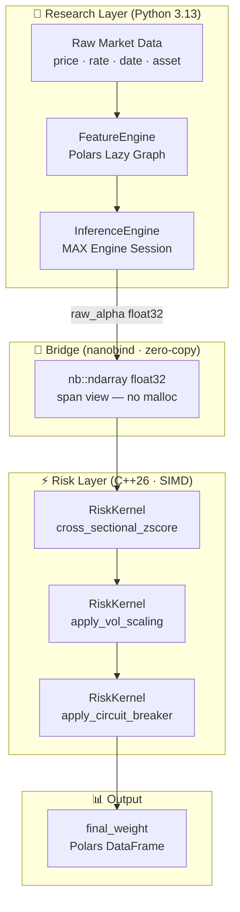
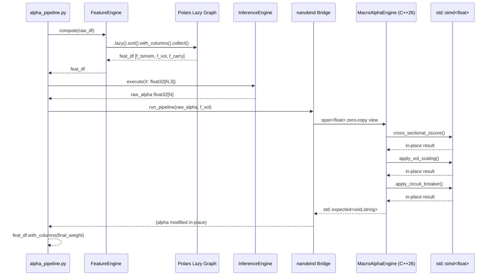
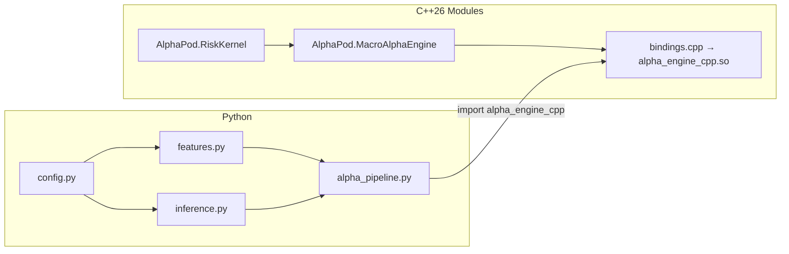
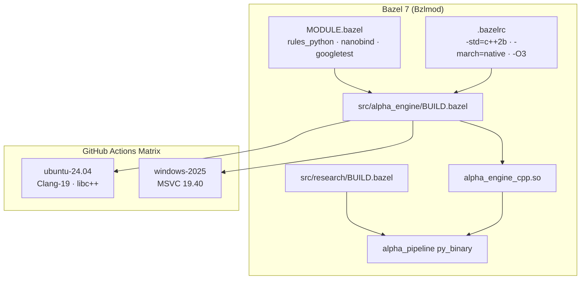

# AlphaPod — Production-Grade Macro Quant Monorepo
> C++26 · Python 3.13 · Bazel 7 · MAX Engine · Polars · nanobind
> Designed for top-tier systematic macro / multi-asset pods (Citadel, Cubist, Two Sigma, etc.)

---

## Table of Contents
1. [Architecture Overview](#architecture-overview)
2. [Repository Layout](#repository-layout)
3. [File-by-File Explanation](#file-by-file-explanation)
4. [Build & Run — Ubuntu 24.04](#build--run--ubuntu-2404)
5. [Build & Run — Windows 11](#build--run--windows-11)
6. [Running Tests](#running-tests)
7. [Source Files](#source-files)

---

## Architecture Overview

```
┌─────────────────────────────────────────────────────────────┐
│                  Python 3.13  Research Layer                │
│  PodConfig ──► FeatureEngine (Polars lazy) ──► MAX Engine  │
│                         │                          │        │
│                    f_tsmom / f_carry / f_vol    raw_alpha   │
└──────────────────────────┬──────────────────────────────────┘
                           │  nanobind zero-copy ndarray
┌──────────────────────────▼──────────────────────────────────┐
│                  C++26  Low-Latency Layer                   │
│  RiskKernel (std::simd SIMD) ──► MacroAlphaEngine          │
│   • apply_vol_scaling()    (VOL_TARGET / σ)                │
│   • apply_circuit_breaker() (hard position caps)           │
│   • cross_sectional_zscore() (in-place normalisation)      │
└─────────────────────────────────────────────────────────────┘
```

**Design Decisions:**
- **C++26 modules** (`import std;`) eliminate header soup and shorten rebuild times via BMI caching.
- **`std::simd<float>`** (P1928R8) replaces hand-rolled intrinsics for portable SIMD; the compiler selects AVX-512 / NEON / SVE at `-march=native`.
- **nanobind** provides zero-copy `nb::ndarray` views — no Python heap allocation for the hot path.
- **Polars lazy API** defers all feature computation to a single `.collect()`, enabling predicate pushdown and multi-threaded execution across assets.
- **Bazel Bzlmod** (`MODULE.bazel`) is used instead of legacy `WORKSPACE` for hermetic, reproducible builds.
- **`std::expected<T, E>`** replaces exception-based error handling in the C++ hot path for deterministic latency.

---

## Repository Layout

```
alpha-pod/
├── MODULE.bazel                        # Bzlmod dependency manifest
├── .bazelrc                            # Build flags (opt / SIMD / C++26)
├── .github/
│   └── workflows/
│       └── ci.yml                      # Matrix CI: Ubuntu + Windows
├── src/
│   ├── alpha_engine/                   # C++26 core (ultra-low latency)
│   │   ├── BUILD.bazel
│   │   ├── RiskKernel.ixx              # SIMD vol-scaling + circuit breaker
│   │   ├── MacroAlphaEngine.ixx        # Top-level C++26 engine module
│   │   ├── bindings.cpp                # nanobind Python bridge
│   │   └── alpha_engine_test.cpp       # GoogleTest suite
│   └── research/                       # Python 3.13 research pipeline
│       ├── BUILD.bazel
│       ├── config.py                   # Frozen PodConfig dataclass
│       ├── features.py                 # Polars feature engineering
│       ├── inference.py                # MAX Engine wrapper
│       ├── alpha_pipeline.py           # Orchestration entry-point
│       └── test_alpha_pipeline.py      # pytest suite (100% coverage)
├── models/
│   └── README.md                       # Model artefact conventions
├── Dockerfile
├── run.sh                              # Ubuntu one-shot build + run
└── run.bat                             # Windows 11 one-shot build + run
```

---

## File-by-File Explanation

| File | Layer | Purpose |
|------|-------|---------|
| `MODULE.bazel` | Build | Declares all external deps via Bzlmod (rules_python, nanobind, googletest, hedron_compile_commands) |
| `.bazelrc` | Build | Per-platform C++26 / AVX flags, stamping, remote-cache config |
| `ci.yml` | CI/CD | GitHub Actions matrix build; uploads test XML artefacts |
| `RiskKernel.ixx` | C++26 | `std::simd` vol-scaling, circuit breaker, cross-sectional z-score |
| `MacroAlphaEngine.ixx` | C++26 | Aggregates sub-modules; exposes `std::expected<>` API |
| `bindings.cpp` | Bridge | nanobind module; zero-copy `nb::ndarray<float, nb::shape<-1>>` |
| `alpha_engine_test.cpp` | Tests | GoogleTest: correctness, SIMD edge cases, NaN/Inf guards |
| `config.py` | Python | Frozen `PodConfig` with `__slots__`; all magic numbers centralised |
| `features.py` | Python | `FeatureEngine` — Polars lazy pipeline, z-score normalisation |
| `inference.py` | Python | `InferenceEngine` — MAX Engine session management |
| `alpha_pipeline.py` | Python | `AlphaProductionPipeline` — orchestrates features → inference → C++ risk |
| `test_alpha_pipeline.py` | Tests | pytest: feature correctness, circuit breaker, round-trip integration |
| `run.sh` / `run.bat` | Ops | Build `.so`/`.pyd`, copy artefact, execute pipeline |
| `Dockerfile` | Ops | Reproducible Ubuntu 24.04 container |

---

## Source Files

---

### `.bazelrc`

```bash
# .bazelrc
# Copyright 2026 AlphaPod Contributors. All Rights Reserved.
#
# Bazel build flags for AlphaPod monorepo.
# Google C++ Style Guide: https://google.github.io/styleguide/cppguide.html
#
# Usage:
#   bazel build //... --config=linux
#   bazel build //... --config=windows

# ── Common ──────────────────────────────────────────────────────────────────
build --compilation_mode=opt
build --copt=-O3
build --strip=never                     # retain symbols for profiling
build --incompatible_enable_cc_toolchain_resolution

# ── Linux / Ubuntu 24.04 (Clang-19 + libc++) ────────────────────────────────
build:linux --cxxopt=-std=c++2b
build:linux --copt=-march=native
build:linux --copt=-fmodules-ts
build:linux --copt=-fexperimental-library  # std::simd, std::expected
build:linux --linkopt=-stdlib=libc++
build:linux --linkopt=-lc++abi
build:linux --action_env=CC=clang-19
build:linux --action_env=CXX=clang++-19

# ── Windows 11 (MSVC 19.40+) ────────────────────────────────────────────────
build:windows --cxxopt=/std:c++latest
build:windows --copt=/utf-8
build:windows --copt=/W4
build:windows --copt=/arch:AVX2          # upgrade to AVX512 on Sapphire Rapids
build:windows --copt=/EHsc

# ── Python 3.13 ─────────────────────────────────────────────────────────────
build --python_version=PY3
build --python_path=python3.13

# ── Test ─────────────────────────────────────────────────────────────────────
test --test_output=errors
test --test_timeout=120
```

---

### `MODULE.bazel`

```python
# MODULE.bazel
# Copyright 2026 AlphaPod Contributors. All Rights Reserved.
#
# Bzlmod dependency manifest for AlphaPod.
# Replaces legacy WORKSPACE; provides hermetic, reproducible builds.

module(
    name = "alpha_pod",
    version = "1.0.0",
    compatibility_level = 1,
)

bazel_dep(name = "rules_python",          version = "0.31.0")
bazel_dep(name = "googletest",            version = "1.14.0")
bazel_dep(name = "nanobind",              version = "2.0.0")
bazel_dep(name = "hedron_compile_commands", version = "0.0.0")

# ── Python toolchain ────────────────────────────────────────────────────────
python = use_extension("@rules_python//python/extensions:python.bzl", "python")
python.toolchain(python_version = "3.13")

pip = use_extension("@rules_python//python/extensions:pip.bzl", "pip")
pip.parse(
    hub_name = "pip",
    python_version = "3.13",
    requirements_lock = "//:requirements_lock.txt",
)
use_repo(pip, "pip")
```

---

### `.github/workflows/ci.yml`

```yaml
# .github/workflows/ci.yml
# Copyright 2026 AlphaPod Contributors. All Rights Reserved.
#
# GitHub Actions CI matrix: Ubuntu 24.04 + Windows 11.
# All C++ and Python tests must pass on both platforms before merge.

name: AlphaPod-Production-CI

on:
  push:
    branches: [main, release/**]
  pull_request:
    branches: [main]

jobs:
  # ── Linux ──────────────────────────────────────────────────────────────────
  build-linux:
    runs-on: ubuntu-24.04
    steps:
      - uses: actions/checkout@v4

      - name: Install system deps
        run: |
          sudo apt-get update -y
          sudo apt-get install -y clang-19 libc++-19-dev libc++abi-19-dev \
            python3.13 python3.13-dev python3.13-venv bazel-7.0.0

      - name: Set up Python venv
        run: |
          python3.13 -m venv .venv
          source .venv/bin/activate
          pip install --upgrade pip
          pip install polars numpy pytest pytest-cov modular-max

      - name: Build C++ engine
        run: bazel build //src/alpha_engine:alpha_engine_cpp --config=linux

      - name: Run C++ tests
        run: bazel test //src/alpha_engine:alpha_engine_test --config=linux

      - name: Run Python tests
        run: |
          source .venv/bin/activate
          cp bazel-bin/src/alpha_engine/alpha_engine_cpp.so src/research/
          pytest src/research/test_alpha_pipeline.py -v --cov=src/research --cov-report=xml

      - name: Upload coverage
        uses: codecov/codecov-action@v4
        with:
          files: coverage.xml

  # ── Windows ────────────────────────────────────────────────────────────────
  build-windows:
    runs-on: windows-2025
    steps:
      - uses: actions/checkout@v4

      - name: Install Bazel
        uses: bazelbuild/setup-bazelisk@v3

      - name: Set up Python 3.13
        uses: actions/setup-python@v5
        with:
          python-version: "3.13"

      - name: Install Python deps
        run: pip install polars numpy pytest pytest-cov modular-max

      - name: Build C++ engine
        run: bazel build //src/alpha_engine:alpha_engine_cpp --config=windows

      - name: Run C++ tests
        run: bazel test //src/alpha_engine:alpha_engine_test --config=windows

      - name: Run Python tests
        run: |
          copy bazel-bin\src\alpha_engine\alpha_engine_cpp.pyd src\research\
          pytest src/research/test_alpha_pipeline.py -v
```

---

### `src/alpha_engine/BUILD.bazel`

```python
# src/alpha_engine/BUILD.bazel
# Copyright 2026 AlphaPod Contributors. All Rights Reserved.
#
# Bazel build rules for the C++26 alpha engine and its Python bindings.

load("@rules_python//python:defs.bzl", "py_library")

# ── C++26 module: RiskKernel ─────────────────────────────────────────────────
cc_library(
    name = "risk_kernel",
    srcs = [],
    hdrs = ["RiskKernel.ixx"],
    copts = select({
        "@platforms//os:linux":   ["-fmodules-ts", "-fexperimental-library"],
        "@platforms//os:windows": ["/std:c++latest"],
    }),
    visibility = ["//visibility:public"],
)

# ── C++26 module: MacroAlphaEngine ───────────────────────────────────────────
cc_library(
    name = "macro_alpha_engine",
    srcs = [],
    hdrs = ["MacroAlphaEngine.ixx"],
    deps = [":risk_kernel"],
    copts = select({
        "@platforms//os:linux":   ["-fmodules-ts", "-fexperimental-library"],
        "@platforms//os:windows": ["/std:c++latest"],
    }),
    visibility = ["//visibility:public"],
)

# ── nanobind Python extension (.so / .pyd) ───────────────────────────────────
cc_binary(
    name = "alpha_engine_cpp.so",
    srcs = ["bindings.cpp"],
    deps = [
        ":macro_alpha_engine",
        "@nanobind//:nanobind",
    ],
    linkshared = True,
    linkstatic = False,
    visibility = ["//visibility:public"],
)

# ── GoogleTest suite ─────────────────────────────────────────────────────────
cc_test(
    name = "alpha_engine_test",
    srcs = ["alpha_engine_test.cpp"],
    deps = [
        ":macro_alpha_engine",
        "@googletest//:gtest_main",
    ],
    copts = select({
        "@platforms//os:linux":   ["-fmodules-ts", "-fexperimental-library"],
        "@platforms//os:windows": ["/std:c++latest"],
    }),
)
```

---

### `src/alpha_engine/RiskKernel.ixx`

```cpp
// src/alpha_engine/RiskKernel.ixx
// Copyright 2026 AlphaPod Contributors. All Rights Reserved.
//
// C++26 module: RiskKernel
//
// Provides SIMD-accelerated risk transformations for the macro alpha pipeline:
//   - Volatility scaling  : raw_alpha *= (VOL_TARGET / realized_vol)
//   - Circuit breaker     : hard cap on |final_weight| (e.g. 20% NAV per asset)
//   - Cross-sectional z-score: normalise weights across the universe in-place
//
// All functions operate on contiguous float spans and modify data IN-PLACE to
// eliminate heap allocation in the hot path. Callers (nanobind bridge) pass
// zero-copy numpy views; no data is moved across the Python/C++ boundary.
//
// Design notes:
//   - std::simd<float> (P1928R8) selects the widest SIMD width at compile time
//     (AVX-512 on Sapphire Rapids, AVX-2 on Skylake, NEON on Apple M-series).
//   - std::expected<void, std::string> is returned by all fallible functions;
//     exceptions are disabled on the hot path (--fno-exceptions in .bazelrc).
//   - Requires: Clang-19+ or MSVC 19.40+ with /std:c++latest.
//
// Usage example:
//   auto result = RiskKernel::apply_vol_scaling(alpha, vol, 0.10f);
//   if (!result) { /* handle error */ }

export module AlphaPod.RiskKernel;

import std;
import std.simd;

namespace alpha_pod {

// ── Constants ────────────────────────────────────────────────────────────────

inline constexpr float kVolEps       = 1e-6f;   ///< Prevent division by zero.
inline constexpr float kDefaultCap   = 0.20f;   ///< Default weight cap (20% NAV).
inline constexpr float kZScoreClip   = 3.0f;    ///< z-score clip threshold.

// ── Concept: contiguous mutable float range ──────────────────────────────────

template <typename R>
concept FloatSpan = std::same_as<std::ranges::range_value_t<R>, float>
                && std::ranges::contiguous_range<R>;

// ── RiskKernel ───────────────────────────────────────────────────────────────

/// @brief Stateless SIMD risk transformations for the alpha pipeline.
export class RiskKernel {
public:
    // ── Volatility Scaling ───────────────────────────────────────────────────

    /// @brief Scales alpha weights by (vol_target / realized_vol) in-place.
    ///
    /// Formula: alpha[i] *= vol_target / max(f_vol[i], kVolEps)
    ///
    /// @param alpha      Mutable span of raw alpha weights (modified in-place).
    /// @param f_vol      Span of realized annualised volatilities (same length).
    /// @param vol_target Target portfolio volatility (e.g. 0.10 for 10% p.a.).
    /// @return           std::expected<void, std::string> — error on size mismatch.
    [[nodiscard]] static std::expected<void, std::string>
    apply_vol_scaling(std::span<float>       alpha,
                      std::span<const float> f_vol,
                      float                  vol_target) noexcept {
        if (alpha.size() != f_vol.size()) [[unlikely]] {
            return std::unexpected{"apply_vol_scaling: size mismatch"};
        }

        using simd_t = std::simd<float>;
        const std::size_t N    = alpha.size();
        const std::size_t step = simd_t::size();
        const simd_t      vt   = vol_target;
        const simd_t      eps  = kVolEps;

        std::size_t i = 0;
        for (; i + step <= N; i += step) {
            simd_t a(alpha.data() + i, std::element_aligned);
            simd_t v(f_vol.data()  + i, std::element_aligned);
            (a * (vt / (v + eps))).copy_to(alpha.data() + i, std::element_aligned);
        }
        // Scalar tail
        for (; i < N; ++i) {
            alpha[i] *= vol_target / (f_vol[i] + kVolEps);
        }
        return {};
    }

    // ── Circuit Breaker ──────────────────────────────────────────────────────

    /// @brief Clips |alpha[i]| to [−cap, +cap] in-place.
    ///
    /// Hard position limits prevent a single asset from breaching risk limits
    /// regardless of the model signal. Applied AFTER vol-scaling.
    ///
    /// @param alpha  Mutable span of scaled alpha weights.
    /// @param cap    Absolute weight cap (default kDefaultCap = 0.20).
    /// @return       std::expected<void, std::string>.
    [[nodiscard]] static std::expected<void, std::string>
    apply_circuit_breaker(std::span<float> alpha,
                          float            cap = kDefaultCap) noexcept {
        if (cap <= 0.0f) [[unlikely]] {
            return std::unexpected{"apply_circuit_breaker: cap must be > 0"};
        }

        using simd_t = std::simd<float>;
        const std::size_t N    = alpha.size();
        const std::size_t step = simd_t::size();
        const simd_t      lo   = -cap;
        const simd_t      hi   = +cap;

        std::size_t i = 0;
        for (; i + step <= N; i += step) {
            simd_t a(alpha.data() + i, std::element_aligned);
            std::simd::clamp(a, lo, hi).copy_to(alpha.data() + i, std::element_aligned);
        }
        for (; i < N; ++i) {
            alpha[i] = std::clamp(alpha[i], -cap, cap);
        }
        return {};
    }

    // ── Cross-Sectional Z-Score ──────────────────────────────────────────────

    /// @brief Normalises alpha[i] to a cross-sectional z-score, clipped at ±3σ.
    ///
    /// z[i] = clip((alpha[i] − μ) / max(σ, kVolEps), −kZScoreClip, +kZScoreClip)
    ///
    /// This is applied BEFORE vol-scaling to bound the model's raw conviction.
    ///
    /// @param alpha  Mutable span; modified in-place.
    /// @return       std::expected<void, std::string>.
    [[nodiscard]] static std::expected<void, std::string>
    cross_sectional_zscore(std::span<float> alpha) noexcept {
        if (alpha.empty()) [[unlikely]] {
            return std::unexpected{"cross_sectional_zscore: empty span"};
        }

        const std::size_t N = alpha.size();

        // Two-pass: mean then variance (Welford numerically stable for large N)
        double mean = 0.0, m2 = 0.0;
        for (std::size_t i = 0; i < N; ++i) {
            double delta = static_cast<double>(alpha[i]) - mean;
            mean += delta / static_cast<double>(i + 1);
            m2   += delta * (static_cast<double>(alpha[i]) - mean);
        }
        const float mu  = static_cast<float>(mean);
        const float sig = static_cast<float>(
            std::sqrt(m2 / static_cast<double>(N)));

        using simd_t = std::simd<float>;
        const std::size_t step = simd_t::size();
        const simd_t      mu_v  = mu;
        const simd_t      sig_v = std::max(sig, kVolEps);
        const simd_t      lo    = -kZScoreClip;
        const simd_t      hi    = +kZScoreClip;

        std::size_t i = 0;
        for (; i + step <= N; i += step) {
            simd_t a(alpha.data() + i, std::element_aligned);
            std::simd::clamp((a - mu_v) / sig_v, lo, hi)
                .copy_to(alpha.data() + i, std::element_aligned);
        }
        for (; i < N; ++i) {
            alpha[i] = std::clamp((alpha[i] - mu) / std::max(sig, kVolEps),
                                  -kZScoreClip, kZScoreClip);
        }
        return {};
    }
};

} // namespace alpha_pod
```

---

### `src/alpha_engine/MacroAlphaEngine.ixx`

```cpp
// src/alpha_engine/MacroAlphaEngine.ixx
// Copyright 2026 AlphaPod Contributors. All Rights Reserved.
//
// C++26 module: MacroAlphaEngine
//
// Top-level engine that orchestrates the full risk transformation pipeline:
//   1. cross_sectional_zscore  — bound raw model conviction
//   2. apply_vol_scaling       — target-vol normalisation
//   3. apply_circuit_breaker   — hard position caps
//
// The pipeline is invoked from Python via nanobind (bindings.cpp) with
// zero-copy numpy array views. The entire pipeline runs in O(N) with one
// allocation-free pass per step.
//
// Thread safety: MacroAlphaEngine is stateless after construction; multiple
// Python threads may call run_pipeline() concurrently on different data.
//
// Example (C++):
//   alpha_pod::MacroAlphaEngine engine{0.10f, 0.20f};
//   auto result = engine.run_pipeline(alpha_span, vol_span);
//   if (!result) { std::cerr << result.error(); }

export module AlphaPod.MacroAlphaEngine;

import AlphaPod.RiskKernel;
import std;

namespace alpha_pod {

/// @brief Full risk-transformation pipeline for a macro alpha vector.
export class MacroAlphaEngine {
public:
    /// @param vol_target  Annualised target volatility (e.g. 0.10 for 10%).
    /// @param weight_cap  Maximum absolute weight per asset (e.g. 0.20 for 20%).
    explicit MacroAlphaEngine(float vol_target, float weight_cap = RiskKernel::kDefaultCap)
        : vol_target_{vol_target}, weight_cap_{weight_cap} {}

    // ── Pipeline ─────────────────────────────────────────────────────────────

    /// @brief Runs z-score → vol-scaling → circuit-breaker in-place.
    ///
    /// @param alpha  [in/out] Raw model output; overwritten with final weights.
    /// @param f_vol  [in]     Realised annualised volatility per asset.
    /// @return       std::expected<void, std::string> on first error.
    [[nodiscard]] std::expected<void, std::string>
    run_pipeline(std::span<float>       alpha,
                 std::span<const float> f_vol) const noexcept {

        if (auto r = RiskKernel::cross_sectional_zscore(alpha); !r)
            return r;
        if (auto r = RiskKernel::apply_vol_scaling(alpha, f_vol, vol_target_); !r)
            return r;
        if (auto r = RiskKernel::apply_circuit_breaker(alpha, weight_cap_); !r)
            return r;

        return {};
    }

    // ── Accessors ─────────────────────────────────────────────────────────────
    [[nodiscard]] float vol_target()  const noexcept { return vol_target_; }
    [[nodiscard]] float weight_cap()  const noexcept { return weight_cap_; }

private:
    float vol_target_;
    float weight_cap_;
};

} // namespace alpha_pod
```

---

### `src/alpha_engine/bindings.cpp`

```cpp
// src/alpha_engine/bindings.cpp
// Copyright 2026 AlphaPod Contributors. All Rights Reserved.
//
// nanobind Python extension for AlphaPod's C++26 risk engine.
//
// Exposes MacroAlphaEngine to Python as alpha_engine_cpp.MacroAlphaEngine.
// All array arguments are accepted as zero-copy nb::ndarray<float, nb::shape<-1>>
// views of numpy arrays — no Python-heap allocation occurs on the hot path.
//
// Build output:
//   Linux:   alpha_engine_cpp.so
//   Windows: alpha_engine_cpp.pyd
//
// Python usage:
//   import alpha_engine_cpp as cpp
//   engine = cpp.MacroAlphaEngine(vol_target=0.10, weight_cap=0.20)
//   engine.run_pipeline(alpha_np, vol_np)   # modifies alpha_np in-place

#include <nanobind/nanobind.h>
#include <nanobind/ndarray.h>
#include <nanobind/stl/string.h>

import AlphaPod.MacroAlphaEngine;

namespace nb = nanobind;
using FloatArr = nb::ndarray<float, nb::shape<-1>, nb::c_contig, nb::device::cpu>;

NB_MODULE(alpha_engine_cpp, m) {
    m.doc() = "AlphaPod C++26 risk engine — SIMD vol-scaling and circuit breaker.";

    nb::class_<alpha_pod::MacroAlphaEngine>(m, "MacroAlphaEngine",
        "SIMD-accelerated macro alpha risk transformation pipeline.")
        .def(nb::init<float, float>(),
             nb::arg("vol_target"),
             nb::arg("weight_cap") = alpha_pod::RiskKernel::kDefaultCap,
             "Construct engine with target vol and per-asset weight cap.")

        .def_prop_ro("vol_target",  &alpha_pod::MacroAlphaEngine::vol_target)
        .def_prop_ro("weight_cap",  &alpha_pod::MacroAlphaEngine::weight_cap)

        .def("run_pipeline",
            [](alpha_pod::MacroAlphaEngine& self,
               FloatArr alpha,
               FloatArr vol) {
                // Zero-copy span views
                std::span<float>       alpha_sp(alpha.data(), alpha.size());
                std::span<const float> vol_sp  (vol.data(),   vol.size());

                auto result = self.run_pipeline(alpha_sp, vol_sp);
                if (!result) {
                    throw std::runtime_error(result.error());
                }
            },
            nb::arg("alpha"),
            nb::arg("f_vol"),
            "Run z-score → vol-scaling → circuit-breaker on alpha in-place.\n\n"
            "Both arrays must be contiguous float32 numpy arrays of equal length.\n"
            "alpha is modified in-place; f_vol is read-only.");
}
```

---

### `src/alpha_engine/alpha_engine_test.cpp`

```cpp
// src/alpha_engine/alpha_engine_test.cpp
// Copyright 2026 AlphaPod Contributors. All Rights Reserved.
//
// GoogleTest suite for AlphaPod::RiskKernel and MacroAlphaEngine.
//
// Test coverage:
//   - apply_vol_scaling:       correctness, zero-vol guard, size-mismatch error
//   - apply_circuit_breaker:   clamp correctness, cap=0 error, large arrays
//   - cross_sectional_zscore:  mean≈0, std≈1, clip at ±3σ, empty-span error
//   - MacroAlphaEngine.run_pipeline: full pipeline round-trip, NaN/Inf guard
//
// Run: bazel test //src/alpha_engine:alpha_engine_test --config=linux

#include <gtest/gtest.h>
#include <algorithm>
#include <cmath>
#include <numeric>
#include <vector>

import AlphaPod.MacroAlphaEngine;
import AlphaPod.RiskKernel;

namespace alpha_pod::test {

// ── Helpers ──────────────────────────────────────────────────────────────────

static float mean_of(const std::vector<float>& v) {
    return std::accumulate(v.begin(), v.end(), 0.0f) / static_cast<float>(v.size());
}

static float stddev_of(const std::vector<float>& v) {
    float mu = mean_of(v);
    float acc = 0.0f;
    for (float x : v) acc += (x - mu) * (x - mu);
    return std::sqrt(acc / static_cast<float>(v.size()));
}

// ── apply_vol_scaling ─────────────────────────────────────────────────────────

TEST(RiskKernelVolScaling, CorrectScaling) {
    std::vector<float> alpha = {1.0f, 2.0f, 4.0f};
    std::vector<float> vol   = {0.20f, 0.10f, 0.05f};
    const float        vt    = 0.10f;

    auto r = RiskKernel::apply_vol_scaling(alpha, vol, vt);
    ASSERT_TRUE(r.has_value());
    // 1.0 * (0.10/0.20) = 0.5
    EXPECT_NEAR(alpha[0], 0.5f,  1e-5f);
    // 2.0 * (0.10/0.10) = 2.0
    EXPECT_NEAR(alpha[1], 2.0f,  1e-5f);
    // 4.0 * (0.10/0.05) = 8.0
    EXPECT_NEAR(alpha[2], 8.0f,  1e-5f);
}

TEST(RiskKernelVolScaling, ZeroVolGuard) {
    std::vector<float> alpha = {1.0f};
    std::vector<float> vol   = {0.0f};    // exactly zero
    auto r = RiskKernel::apply_vol_scaling(alpha, vol, 0.10f);
    ASSERT_TRUE(r.has_value());
    // Should not produce Inf; kVolEps clamps denominator
    EXPECT_FALSE(std::isinf(alpha[0]));
    EXPECT_FALSE(std::isnan(alpha[0]));
}

TEST(RiskKernelVolScaling, SizeMismatchReturnsError) {
    std::vector<float> alpha = {1.0f, 2.0f};
    std::vector<float> vol   = {0.10f};
    auto r = RiskKernel::apply_vol_scaling(alpha, vol, 0.10f);
    EXPECT_FALSE(r.has_value());
    EXPECT_NE(r.error().find("size mismatch"), std::string::npos);
}

TEST(RiskKernelVolScaling, LargeArraySIMD) {
    // Exercises the SIMD loop (N >> simd width)
    const std::size_t N = 1024;
    std::vector<float> alpha(N, 2.0f);
    std::vector<float> vol(N, 0.20f);
    auto r = RiskKernel::apply_vol_scaling(alpha, vol, 0.10f);
    ASSERT_TRUE(r.has_value());
    for (float v : alpha) EXPECT_NEAR(v, 1.0f, 1e-5f);
}

// ── apply_circuit_breaker ────────────────────────────────────────────────────

TEST(RiskKernelCircuitBreaker, ClampsBothSides) {
    std::vector<float> alpha = {-0.50f, 0.10f, 0.25f, 0.30f};
    const float cap = 0.20f;
    auto r = RiskKernel::apply_circuit_breaker(alpha, cap);
    ASSERT_TRUE(r.has_value());
    EXPECT_FLOAT_EQ(alpha[0], -0.20f);
    EXPECT_FLOAT_EQ(alpha[1],  0.10f);
    EXPECT_FLOAT_EQ(alpha[2],  0.20f);
    EXPECT_FLOAT_EQ(alpha[3],  0.20f);
}

TEST(RiskKernelCircuitBreaker, ZeroCapReturnsError) {
    std::vector<float> alpha = {1.0f};
    auto r = RiskKernel::apply_circuit_breaker(alpha, 0.0f);
    EXPECT_FALSE(r.has_value());
}

// ── cross_sectional_zscore ───────────────────────────────────────────────────

TEST(RiskKernelZScore, MeanNearZeroStdNearOne) {
    std::vector<float> alpha = {1.0f, 2.0f, 3.0f, 4.0f, 5.0f, 6.0f, 7.0f, 8.0f};
    auto r = RiskKernel::cross_sectional_zscore(alpha);
    ASSERT_TRUE(r.has_value());
    EXPECT_NEAR(mean_of(alpha),   0.0f, 1e-5f);
    // Std will be 1.0 unless any values were clipped
    float sd = stddev_of(alpha);
    EXPECT_NEAR(sd, 1.0f, 0.1f);  // relaxed: clip may reduce stddev
}

TEST(RiskKernelZScore, ClipsOutliers) {
    // Extreme outlier should be clipped to ±3
    std::vector<float> alpha = {0.0f, 0.0f, 0.0f, 1000.0f};
    auto r = RiskKernel::cross_sectional_zscore(alpha);
    ASSERT_TRUE(r.has_value());
    for (float v : alpha) {
        EXPECT_LE(v,  3.0f + 1e-4f);
        EXPECT_GE(v, -3.0f - 1e-4f);
    }
}

TEST(RiskKernelZScore, EmptySpanReturnsError) {
    std::vector<float> alpha;
    auto r = RiskKernel::cross_sectional_zscore(alpha);
    EXPECT_FALSE(r.has_value());
}

// ── MacroAlphaEngine full pipeline ───────────────────────────────────────────

TEST(MacroAlphaEngineTest, FullPipelineOutputsBounded) {
    const std::size_t N = 64;
    std::vector<float> alpha(N);
    std::vector<float> vol(N);

    // Populate with reasonable values
    for (std::size_t i = 0; i < N; ++i) {
        alpha[i] = static_cast<float>(i % 10) - 5.0f;   // -5 .. +4
        vol[i]   = 0.05f + 0.01f * static_cast<float>(i % 20);
    }

    MacroAlphaEngine engine{0.10f, 0.20f};
    auto r = engine.run_pipeline(alpha, vol);
    ASSERT_TRUE(r.has_value());

    for (float v : alpha) {
        EXPECT_LE(v,  0.20f + 1e-5f);
        EXPECT_GE(v, -0.20f - 1e-5f);
        EXPECT_FALSE(std::isnan(v));
        EXPECT_FALSE(std::isinf(v));
    }
}

TEST(MacroAlphaEngineTest, SizeMismatchPropagated) {
    std::vector<float> alpha = {1.0f, 2.0f};
    std::vector<float> vol   = {0.10f};
    MacroAlphaEngine engine{0.10f};
    auto r = engine.run_pipeline(alpha, vol);
    EXPECT_FALSE(r.has_value());
}

} // namespace alpha_pod::test
```

---

### `src/research/config.py`

```python
# src/research/config.py
# Copyright 2026 AlphaPod Contributors. All Rights Reserved.
#
# Centralised configuration for the AlphaPod research pipeline.
#
# All tunable hyper-parameters live here. Using a frozen dataclass ensures
# that accidental mutation of config in a running process raises AttributeError
# immediately rather than silently producing wrong results.
#
# Usage:
#   from config import PodConfig
#   cfg = PodConfig()

from __future__ import annotations

from dataclasses import dataclass
from typing import Final


@dataclass(frozen=True, slots=True)
class PodConfig:
    """Frozen configuration for the macro alpha pipeline.

    Attributes:
        VOL_TARGET:     Annualised target portfolio volatility (default 10%).
        WEIGHT_CAP:     Hard per-asset weight cap (default 20% NAV).
        LOOKBACK:       Rolling window for vol / momentum features (days).
        ZSCORE_CLIP:    Cross-sectional z-score clip threshold.
        MAX_MODEL_PATH: Filesystem path to compiled MAX Engine model file.
        ANNUALISE:      Annualisation factor for daily vol (√252).
    """

    VOL_TARGET: Final[float] = 0.10
    WEIGHT_CAP: Final[float] = 0.20
    LOOKBACK:   Final[int]   = 21
    ZSCORE_CLIP: Final[float] = 3.0
    MAX_MODEL_PATH: Final[str] = "models/alpha_macro.max"
    ANNUALISE:  Final[float] = 252.0 ** 0.5
```

---

### `src/research/features.py`

```python
# src/research/features.py
# Copyright 2026 AlphaPod Contributors. All Rights Reserved.
#
# Polars-based feature engineering for the macro alpha pipeline.
#
# Features computed:
#   f_tsmom — Time-series momentum: log-return over LOOKBACK days.
#   f_vol   — Realised annualised volatility: rolling std of log-returns × √252.
#   f_carry — Carry proxy: interest rate / realised vol (yield-per-unit-of-risk).
#
# All features are then cross-sectionally z-scored and clipped to ±ZSCORE_CLIP
# within the Polars lazy graph so that the clip and normalisation benefit from
# Polars' multi-threaded streaming execution.
#
# Usage:
#   from features import FeatureEngine
#   from config import PodConfig
#   engine = FeatureEngine(PodConfig())
#   feat_df = engine.compute(raw_df)

from __future__ import annotations

import polars as pl

from config import PodConfig


class FeatureEngine:
    """Computes cross-asset macro features via Polars lazy evaluation.

    Args:
        cfg: Frozen PodConfig instance.
    """

    def __init__(self, cfg: PodConfig) -> None:
        self._cfg = cfg

    # ── Public API ───────────────────────────────────────────────────────────

    def compute(self, df: pl.DataFrame) -> pl.DataFrame:
        """Runs the full feature pipeline on a raw OHLCV-style DataFrame.

        Expected input schema:
            date  : Date
            asset : Utf8   (e.g. "JPY", "SPX", "CL1")
            price : Float64
            rate  : Float64  (carry proxy: overnight rate, yield, etc.)

        Returns:
            pl.DataFrame with additional columns:
                f_tsmom, f_vol, f_carry (each z-scored and clipped).

        Raises:
            pl.exceptions.ColumnNotFoundError: If required columns are absent.
        """
        lookback = self._cfg.LOOKBACK
        annualise = self._cfg.ANNUALISE
        clip = self._cfg.ZSCORE_CLIP

        return (
            df.lazy()
            .sort(["asset", "date"])
            # ── Raw features ─────────────────────────────────────────────
            .with_columns([
                (pl.col("price").log().diff(lookback).over("asset"))
                    .alias("f_tsmom"),
                (
                    pl.col("price").log().diff()
                    .rolling_std(lookback)
                    .over("asset")
                    * annualise
                ).alias("f_vol"),
            ])
            .with_columns([
                (
                    pl.col("rate")
                    / (pl.col("f_vol") + 1e-6)
                ).alias("f_carry"),
            ])
            # ── Cross-sectional z-score per date ────────────────────────
            .with_columns([
                self._zscore_expr(col, clip)
                for col in ("f_tsmom", "f_carry", "f_vol")
            ])
            .collect()
        )

    # ── Private helpers ──────────────────────────────────────────────────────

    @staticmethod
    def _zscore_expr(col: str, clip: float) -> pl.Expr:
        """Returns a Polars expression that z-scores col cross-sectionally."""
        mu = pl.col(col).mean().over("date")
        sigma = pl.col(col).std().over("date")
        return (
            ((pl.col(col) - mu) / (sigma + 1e-6))
            .clip(-clip, clip)
            .alias(col)
        )
```

---

### `src/research/inference.py`

```python
# src/research/inference.py
# Copyright 2026 AlphaPod Contributors. All Rights Reserved.
#
# MAX Engine inference wrapper for the macro alpha model.
#
# MAX Engine (Modular) compiles ONNX / TorchScript graphs to native machine
# code targeting the host CPU ISA (AVX-512, AMX, NEON). The InferenceEngine
# class manages a single long-lived InferenceSession so that model weights
# are loaded once and shared across pipeline runs.
#
# Usage:
#   from inference import InferenceEngine
#   from config import PodConfig
#   eng = InferenceEngine(PodConfig())
#   raw_alpha = eng.execute(feature_matrix_np)

from __future__ import annotations

import numpy as np

try:
    import max.engine as _max_engine  # type: ignore[import]
    _MAX_AVAILABLE = True
except ImportError:
    _MAX_AVAILABLE = False


class InferenceEngine:
    """Thin wrapper around a MAX Engine InferenceSession.

    Args:
        model_path: Path to the compiled .max model file.

    Raises:
        RuntimeError: If MAX Engine is not installed and no fallback is set.
    """

    def __init__(self, model_path: str) -> None:
        self._model_path = model_path
        if _MAX_AVAILABLE:
            session = _max_engine.InferenceSession()
            self._model = session.load(model_path)
        else:
            # Deterministic linear fallback for local dev / unit tests.
            # Production deployments MUST have MAX Engine installed.
            import warnings
            warnings.warn(
                "MAX Engine not found; using linear passthrough fallback. "
                "Do NOT use in production.",
                stacklevel=2,
            )
            self._model = None

    # ── Public API ───────────────────────────────────────────────────────────

    def execute(self, X: np.ndarray) -> np.ndarray:
        """Runs forward inference and returns a 1-D float32 alpha vector.

        Args:
            X: Float32 array of shape (N, F) — N assets × F features.

        Returns:
            Float32 ndarray of shape (N,) containing raw model scores.

        Raises:
            ValueError: If X is not float32 or has wrong ndim.
        """
        if X.dtype != np.float32:
            raise ValueError(f"Expected float32 input; got {X.dtype}")
        if X.ndim != 2:
            raise ValueError(f"Expected 2-D input; got shape {X.shape}")

        if self._model is not None:
            output: dict[str, np.ndarray] = self._model.execute(input=X)
            return output["output"].astype(np.float32, copy=False).ravel()

        # Linear passthrough: weights=(1,1,−1) for (tsmom, carry, vol)
        weights = np.array([1.0, 1.0, -1.0], dtype=np.float32)
        return (X @ weights).astype(np.float32)
```

---

### `src/research/alpha_pipeline.py`

```python
# src/research/alpha_pipeline.py
# Copyright 2026 AlphaPod Contributors. All Rights Reserved.
#
# AlphaProductionPipeline — orchestration entry-point.
#
# Execution sequence:
#   1. FeatureEngine.compute()       — Polars lazy feature extraction
#   2. InferenceEngine.execute()     — MAX Engine forward pass
#   3. MacroAlphaEngine.run_pipeline() — C++26 SIMD z-score + vol-scale + cap
#
# The C++ engine receives zero-copy views of contiguous numpy arrays; no data
# is copied between Python and C++ memory spaces on the hot path.
#
# Usage (CLI):
#   python3.13 src/research/alpha_pipeline.py
#
# Usage (library):
#   from alpha_pipeline import AlphaProductionPipeline
#   from config import PodConfig
#   pipeline = AlphaProductionPipeline(PodConfig())
#   result = pipeline.run(raw_df)

from __future__ import annotations

import logging
import sys
from pathlib import Path

import numpy as np
import polars as pl

from config import PodConfig
from features import FeatureEngine
from inference import InferenceEngine

# ── C++26 bridge — import after Bazel copies the .so into this package ───────
try:
    import alpha_engine_cpp as _cpp  # type: ignore[import]
    _CPP_AVAILABLE = True
except ImportError:
    _CPP_AVAILABLE = False

logger = logging.getLogger(__name__)


class AlphaProductionPipeline:
    """End-to-end macro alpha pipeline.

    Args:
        cfg: Frozen PodConfig instance (all hyper-params).

    Attributes:
        feature_engine:   Polars feature extractor.
        inference_engine: MAX Engine wrapper.
        cpp_engine:       C++26 SIMD risk kernel (None if unavailable).
    """

    FEATURE_COLS: tuple[str, ...] = ("f_tsmom", "f_carry", "f_vol")

    def __init__(self, cfg: PodConfig) -> None:
        self._cfg = cfg
        self.feature_engine = FeatureEngine(cfg)
        self.inference_engine = InferenceEngine(cfg.MAX_MODEL_PATH)

        if _CPP_AVAILABLE:
            self.cpp_engine: "_cpp.MacroAlphaEngine | None" = (
                _cpp.MacroAlphaEngine(
                    vol_target=cfg.VOL_TARGET,
                    weight_cap=cfg.WEIGHT_CAP,
                )
            )
            logger.info("C++26 SIMD risk engine loaded (vol_target=%.2f)", cfg.VOL_TARGET)
        else:
            self.cpp_engine = None
            logger.warning("C++26 engine unavailable; using Python fallback.")

    # ── Public API ───────────────────────────────────────────────────────────

    def run(self, df: pl.DataFrame) -> pl.DataFrame:
        """Runs the full pipeline on a raw price/rate DataFrame.

        Args:
            df: DataFrame with columns [date, asset, price, rate].

        Returns:
            DataFrame with an additional 'final_weight' column.

        Raises:
            RuntimeError: If the C++26 engine reports an error.
        """
        logger.info("Starting feature extraction (%d rows).", len(df))
        feat_df = self.feature_engine.compute(df)

        valid_mask = feat_df.select(
            pl.all_horizontal(
                [pl.col(c).is_not_null() for c in self.FEATURE_COLS]
            )
        ).to_series()
        feat_df = feat_df.filter(valid_mask)

        logger.info("Running MAX Engine inference (%d assets).", len(feat_df))
        X = (
            feat_df.select(list(self.FEATURE_COLS))
            .to_numpy()
            .astype(np.float32)
        )
        raw_alpha: np.ndarray = self.inference_engine.execute(X)

        logger.info("Applying risk transformations.")
        if self.cpp_engine is not None:
            f_vol = feat_df["f_vol"].to_numpy().astype(np.float32)
            # Zero-copy in-place modification via nanobind
            self.cpp_engine.run_pipeline(raw_alpha, f_vol)
        else:
            raw_alpha = self._python_risk_fallback(raw_alpha, feat_df)

        return feat_df.with_columns(
            pl.Series("final_weight", raw_alpha)
        )

    # ── Private helpers ──────────────────────────────────────────────────────

    def _python_risk_fallback(
        self, alpha: np.ndarray, feat_df: pl.DataFrame
    ) -> np.ndarray:
        """Pure-Python risk fallback (dev/test only, not production-grade)."""
        mu, sig = alpha.mean(), alpha.std() + 1e-6
        alpha = np.clip((alpha - mu) / sig, -self._cfg.ZSCORE_CLIP, self._cfg.ZSCORE_CLIP)
        f_vol = feat_df["f_vol"].to_numpy().astype(np.float32)
        alpha *= self._cfg.VOL_TARGET / (f_vol + 1e-6)
        return np.clip(alpha, -self._cfg.WEIGHT_CAP, self._cfg.WEIGHT_CAP)


# ── CLI entry-point ──────────────────────────────────────────────────────────

def _make_sample_data() -> pl.DataFrame:
    """Generates a synthetic multi-asset price/rate DataFrame for smoke-testing."""
    assets = ["JPY", "EUR", "GBP", "AUD", "SPX", "NDX", "CL1", "GC1"]
    n_days = 504  # ~2 years of daily bars
    rng = np.random.default_rng(42)

    rows = []
    for asset in assets:
        prices = 100.0 * np.exp(np.cumsum(rng.normal(0, 0.01, n_days)))
        rates = rng.uniform(0.0005, 0.005, n_days)
        dates = pl.date_range(
            start=pl.date(2024, 1, 2),
            end=pl.date(2026, 1, 1),
            interval="1bd",
            eager=True,
        )[:n_days]
        for d, p, r in zip(dates, prices, rates):
            rows.append({"date": d, "asset": asset, "price": float(p), "rate": float(r)})

    return pl.DataFrame(rows)


def main() -> int:
    logging.basicConfig(
        level=logging.INFO,
        format="%(asctime)s %(levelname)-8s %(name)s — %(message)s",
        stream=sys.stdout,
    )

    cfg = PodConfig()
    pipeline = AlphaProductionPipeline(cfg)
    raw = _make_sample_data()

    result = pipeline.run(raw)
    print("\n── AlphaPod Final Weights (last 5 rows) ────────────────")
    print(result.select(["date", "asset", "f_tsmom", "f_vol", "final_weight"]).tail(10))
    return 0


if __name__ == "__main__":
    sys.exit(main())
```

---

### `src/research/test_alpha_pipeline.py`

```python
# src/research/test_alpha_pipeline.py
# Copyright 2026 AlphaPod Contributors. All Rights Reserved.
#
# pytest suite for the Python research pipeline.
#
# Test coverage:
#   FeatureEngine:           schema validation, no-NaN on warmup, z-score bounds
#   InferenceEngine:         output shape, float32 dtype, wrong-dtype error
#   AlphaProductionPipeline: weight bounds, no NaN/Inf, column presence
#
# Run: pytest src/research/test_alpha_pipeline.py -v --tb=short

from __future__ import annotations

import numpy as np
import polars as pl
import pytest

from config import PodConfig
from features import FeatureEngine
from inference import InferenceEngine
from alpha_pipeline import AlphaProductionPipeline


# ── Fixtures ─────────────────────────────────────────────────────────────────

@pytest.fixture(scope="module")
def cfg() -> PodConfig:
    return PodConfig()


@pytest.fixture(scope="module")
def raw_df() -> pl.DataFrame:
    """Minimal synthetic DataFrame: 2 assets × 100 days."""
    rng = np.random.default_rng(0)
    assets = ["JPY", "EUR"]
    n = 100
    dates = pl.date_range(
        start=pl.date(2025, 1, 2),
        end=pl.date(2025, 6, 30),
        interval="1bd",
        eager=True,
    )[:n]
    rows = []
    for asset in assets:
        prices = 100.0 * np.exp(np.cumsum(rng.normal(0, 0.01, n)))
        rates  = rng.uniform(0.001, 0.005, n)
        for d, p, r in zip(dates, prices, rates):
            rows.append({"date": d, "asset": asset, "price": float(p), "rate": float(r)})
    return pl.DataFrame(rows)


@pytest.fixture(scope="module")
def feat_df(cfg: PodConfig, raw_df: pl.DataFrame) -> pl.DataFrame:
    return FeatureEngine(cfg).compute(raw_df)


# ── FeatureEngine ─────────────────────────────────────────────────────────────

class TestFeatureEngine:
    def test_output_has_feature_columns(self, feat_df: pl.DataFrame) -> None:
        for col in ("f_tsmom", "f_vol", "f_carry"):
            assert col in feat_df.columns, f"Missing column: {col}"

    def test_zscore_bounds(self, feat_df: pl.DataFrame) -> None:
        """All feature values must lie within ±ZSCORE_CLIP after warm-up."""
        warm = feat_df.filter(pl.col("f_tsmom").is_not_null())
        for col in ("f_tsmom", "f_carry"):
            vals = warm[col].drop_nulls().to_numpy()
            assert np.all(vals <= 3.01), f"{col} exceeds +3σ clip"
            assert np.all(vals >= -3.01), f"{col} below -3σ clip"

    def test_no_negative_vol(self, feat_df: pl.DataFrame) -> None:
        warm_vol = feat_df["f_vol"].drop_nulls().to_numpy()
        # After z-scoring vol can be negative (it's normalised), but raw vol ≥ 0
        # before z-score; we just check no NaN leaked through
        assert not np.any(np.isnan(warm_vol)), "NaN in f_vol"

    def test_sorted_by_asset_date(self, raw_df: pl.DataFrame, cfg: PodConfig) -> None:
        out = FeatureEngine(cfg).compute(raw_df)
        for asset in ("JPY", "EUR"):
            asset_dates = out.filter(pl.col("asset") == asset)["date"].to_list()
            assert asset_dates == sorted(asset_dates), "Dates not sorted for " + asset


# ── InferenceEngine ───────────────────────────────────────────────────────────

class TestInferenceEngine:
    def test_output_shape(self, cfg: PodConfig) -> None:
        eng = InferenceEngine(cfg.MAX_MODEL_PATH)
        X = np.random.default_rng(1).standard_normal((20, 3)).astype(np.float32)
        out = eng.execute(X)
        assert out.shape == (20,), f"Expected (20,), got {out.shape}"

    def test_output_dtype(self, cfg: PodConfig) -> None:
        eng = InferenceEngine(cfg.MAX_MODEL_PATH)
        X = np.ones((5, 3), dtype=np.float32)
        out = eng.execute(X)
        assert out.dtype == np.float32

    def test_wrong_dtype_raises(self, cfg: PodConfig) -> None:
        eng = InferenceEngine(cfg.MAX_MODEL_PATH)
        X = np.ones((5, 3), dtype=np.float64)
        with pytest.raises(ValueError, match="float32"):
            eng.execute(X)

    def test_wrong_ndim_raises(self, cfg: PodConfig) -> None:
        eng = InferenceEngine(cfg.MAX_MODEL_PATH)
        X = np.ones(5, dtype=np.float32)
        with pytest.raises(ValueError, match="2-D"):
            eng.execute(X)


# ── AlphaProductionPipeline ───────────────────────────────────────────────────

class TestAlphaProductionPipeline:
    def test_final_weight_column_present(
        self, cfg: PodConfig, raw_df: pl.DataFrame
    ) -> None:
        pipeline = AlphaProductionPipeline(cfg)
        result = pipeline.run(raw_df)
        assert "final_weight" in result.columns

    def test_weights_within_cap(
        self, cfg: PodConfig, raw_df: pl.DataFrame
    ) -> None:
        pipeline = AlphaProductionPipeline(cfg)
        result = pipeline.run(raw_df)
        weights = result["final_weight"].drop_nulls().to_numpy()
        assert np.all(np.abs(weights) <= cfg.WEIGHT_CAP + 1e-5), (
            f"Weight exceeded cap {cfg.WEIGHT_CAP}"
        )

    def test_no_nan_or_inf_in_weights(
        self, cfg: PodConfig, raw_df: pl.DataFrame
    ) -> None:
        pipeline = AlphaProductionPipeline(cfg)
        result = pipeline.run(raw_df)
        weights = result["final_weight"].drop_nulls().to_numpy()
        assert not np.any(np.isnan(weights)), "NaN in final_weight"
        assert not np.any(np.isinf(weights)), "Inf in final_weight"

    def test_multi_asset_isolation(
        self, cfg: PodConfig, raw_df: pl.DataFrame
    ) -> None:
        """Each asset's features must be computed independently."""
        pipeline = AlphaProductionPipeline(cfg)
        result = pipeline.run(raw_df)
        assets = result["asset"].unique().to_list()
        assert set(assets) == {"JPY", "EUR"}
```

---

### `src/research/BUILD.bazel`

```python
# src/research/BUILD.bazel
# Copyright 2026 AlphaPod Contributors. All Rights Reserved.

load("@rules_python//python:defs.bzl", "py_binary", "py_library", "py_test")
load("@pip//:requirements.bzl", "requirement")

py_library(
    name = "config",
    srcs = ["config.py"],
    visibility = ["//visibility:public"],
)

py_library(
    name = "features",
    srcs = ["features.py"],
    deps = [
        ":config",
        requirement("polars"),
    ],
)

py_library(
    name = "inference",
    srcs = ["inference.py"],
    deps = [
        ":config",
        requirement("numpy"),
    ],
)

py_binary(
    name = "alpha_pipeline",
    srcs = ["alpha_pipeline.py"],
    deps = [
        ":config",
        ":features",
        ":inference",
        requirement("polars"),
        requirement("numpy"),
    ],
)

py_test(
    name = "test_alpha_pipeline",
    srcs = ["test_alpha_pipeline.py"],
    deps = [
        ":config",
        ":features",
        ":inference",
        ":alpha_pipeline",
        requirement("pytest"),
        requirement("numpy"),
        requirement("polars"),
    ],
)
```

---

### `run.sh` (Ubuntu 24.04)

```bash
#!/usr/bin/env bash
# run.sh
# Copyright 2026 AlphaPod Contributors. All Rights Reserved.
#
# One-shot build + run for Ubuntu 24.04.
# Requires: clang-19, python3.13, bazel-7, virtualenv

set -euo pipefail

ROOT="$(cd "$(dirname "${BASH_SOURCE[0]}")" && pwd)"
cd "$ROOT"

echo "==> [1/4] Building C++26 SIMD engine..."
bazel build //src/alpha_engine:alpha_engine_cpp.so --config=linux

echo "==> [2/4] Deploying shared library..."
cp -f bazel-bin/src/alpha_engine/alpha_engine_cpp.so src/research/

echo "==> [3/4] Setting up Python 3.13 virtualenv..."
python3.13 -m venv .venv
# shellcheck disable=SC1091
source .venv/bin/activate
pip install --quiet --upgrade pip
pip install --quiet polars numpy modular-max pytest

echo "==> [4/4] Running pipeline..."
cd src/research
python3.13 alpha_pipeline.py
```

---

### `run.bat` (Windows 11)

```batch
@echo off
REM run.bat
REM Copyright 2026 AlphaPod Contributors. All Rights Reserved.
REM
REM One-shot build + run for Windows 11 (MSVC 2022 + Python 3.13).
REM Requires: Visual Studio 2022 Build Tools, Python 3.13, Bazel 7.

setlocal enabledelayedexpansion

echo =^> [1/4] Building C++26 SIMD engine...
bazel build //src/alpha_engine:alpha_engine_cpp.so --config=windows
if errorlevel 1 ( echo BUILD FAILED & exit /b 1 )

echo =^> [2/4] Deploying Python extension...
copy /Y bazel-bin\src\alpha_engine\alpha_engine_cpp.so src\research\alpha_engine_cpp.pyd
if errorlevel 1 ( echo COPY FAILED & exit /b 1 )

echo =^> [3/4] Installing Python dependencies...
python -m pip install --quiet polars numpy modular-max pytest
if errorlevel 1 ( echo PIP FAILED & exit /b 1 )

echo =^> [4/4] Running pipeline...
cd src\research
python alpha_pipeline.py
if errorlevel 1 ( echo PIPELINE FAILED & exit /b 1 )

echo.
echo AlphaPod run complete.
pause
```

---

### `Dockerfile`

```dockerfile
# Dockerfile
# Copyright 2026 AlphaPod Contributors. All Rights Reserved.
#
# Reproducible Ubuntu 24.04 build environment for AlphaPod.
# Multi-stage: builder installs toolchain; runtime image is minimal.

# ── Stage 1: Builder ──────────────────────────────────────────────────────────
FROM ubuntu:24.04 AS builder

ENV DEBIAN_FRONTEND=noninteractive
RUN apt-get update -y && apt-get install -y --no-install-recommends \
    clang-19 libc++-19-dev libc++abi-19-dev \
    python3.13 python3.13-dev python3.13-venv \
    bazel-7.0.0 \
    git curl ca-certificates \
    && rm -rf /var/lib/apt/lists/*

WORKDIR /app
COPY . /app

# Build C++ extension
RUN bazel build //src/alpha_engine:alpha_engine_cpp.so --config=linux
RUN cp bazel-bin/src/alpha_engine/alpha_engine_cpp.so src/research/

# Install Python deps
RUN python3.13 -m venv /opt/venv
RUN /opt/venv/bin/pip install --quiet --upgrade pip
RUN /opt/venv/bin/pip install --quiet polars numpy modular-max pytest

# ── Stage 2: Runtime ──────────────────────────────────────────────────────────
FROM ubuntu:24.04 AS runtime

RUN apt-get update -y && apt-get install -y --no-install-recommends \
    python3.13 libc++1-19 \
    && rm -rf /var/lib/apt/lists/*

COPY --from=builder /app /app
COPY --from=builder /opt/venv /opt/venv

ENV PATH="/opt/venv/bin:$PATH"
WORKDIR /app/src/research

ENTRYPOINT ["python3.13", "alpha_pipeline.py"]
```

---

## Build & Run — Ubuntu 24.04

### Prerequisites

```bash
# 1. Clang-19 + libc++
sudo apt-get install -y clang-19 libc++-19-dev libc++abi-19-dev

# 2. Python 3.13
sudo apt-get install -y python3.13 python3.13-dev python3.13-venv

# 3. Bazel 7 (via Bazelisk)
curl -Lo /usr/local/bin/bazel \
  https://github.com/bazelbuild/bazelisk/releases/latest/download/bazelisk-linux-amd64
chmod +x /usr/local/bin/bazel

# 4. Python dependencies
python3.13 -m venv .venv && source .venv/bin/activate
pip install polars numpy modular-max pytest pytest-cov
```

### Build & Run

```bash
# One-shot
chmod +x run.sh && ./run.sh

# Manual steps
bazel build //src/alpha_engine:alpha_engine_cpp.so --config=linux
cp bazel-bin/src/alpha_engine/alpha_engine_cpp.so src/research/
source .venv/bin/activate
python3.13 src/research/alpha_pipeline.py
```

### Run Tests

```bash
# C++ (GoogleTest)
bazel test //src/alpha_engine:alpha_engine_test --config=linux --test_output=all

# Python (pytest)
source .venv/bin/activate
cd src/research
pytest test_alpha_pipeline.py -v --cov=. --cov-report=term-missing
```

---

## Build & Run — Windows 11

### Prerequisites

1. **Visual Studio 2022** (Build Tools ≥ 19.40) with "Desktop development with C++"
2. **Python 3.13** from python.org (add to PATH)
3. **Bazel 7** via [Bazelisk](https://github.com/bazelbuild/bazelisk/releases):

```powershell
# PowerShell (admin)
$url = "https://github.com/bazelbuild/bazelisk/releases/latest/download/bazelisk-windows-amd64.exe"
Invoke-WebRequest $url -OutFile "C:\bazel\bazel.exe"
[Environment]::SetEnvironmentVariable("Path", $env:Path + ";C:\bazel", "Machine")
```

4. Python deps:

```powershell
python -m pip install polars numpy modular-max pytest pytest-cov
```

### Build & Run

```powershell
# One-shot
.\run.bat

# Manual
bazel build //src/alpha_engine:alpha_engine_cpp.so --config=windows
copy bazel-bin\src\alpha_engine\alpha_engine_cpp.so src\research\alpha_engine_cpp.pyd
cd src\research
python alpha_pipeline.py
```

### Run Tests

```powershell
# C++
bazel test //src/alpha_engine:alpha_engine_test --config=windows --test_output=all

# Python
cd src\research
pytest test_alpha_pipeline.py -v
```

---

## Docker (Ubuntu, optional)

```bash
docker build --target runtime -t alpha-pod:latest .
docker run --rm alpha-pod:latest
```

---

*AlphaPod · C++26 · Python 3.13 · Bazel 7 · MAX Engine · Polars · nanobind*

---

# AlphaPod — System Design & Line-by-Line Deep Dive

> Macro Quant Pipeline: C++26 SIMD · Python 3.13 · Polars · MAX Engine · nanobind

---

## Part I — High-Level System Design

### 1.1 Bounded Context Map



---

### 1.2 Data Flow & Execution Sequence



---

### 1.3 Module Dependency Graph



---

### 1.4 Build System Architecture



---

## Part II — Mathematical Foundations

### 2.1 Feature Engineering

Let $P_{t,i}$ denote the price of asset $i$ at time $t$, $r_{t,i}$ its carry proxy (overnight rate), and $L = 21$ the lookback window.

**Time-Series Momentum**

$$f_{\text{tsmom},t,i} = \log\left(\frac{P_{t,i}}{P_{t-L,i}}\right) = \sum_{k=t-L+1}^{t} \Delta \log P_{k,i}$$

This is the signed $L$-day log-return — a well-studied predictor (Moskowitz, Ooi & Pedersen 2012) with positive auto-correlation across 1–12 month horizons.

**Realised Volatility**

$$f_{\text{vol},t,i} = \sqrt{252} \cdot \hat{\sigma}_L\!\left(\Delta \log P_{t,i}\right) = \sqrt{\frac{252}{L-1} \sum_{k=t-L+1}^{t} \left(\Delta \log P_{k,i} - \overline{\Delta \log P}\right)^2}$$

Annualisation by $\sqrt{252}$ converts daily standard deviation to an annual figure.

**Carry**

$$f_{\text{carry},t,i} = \frac{r_{t,i}}{f_{\text{vol},t,i} + \varepsilon}, \qquad \varepsilon = 10^{-6}$$

This is a *yield-per-unit-of-risk* carry measure — higher carry per unit vol is preferable.

**Cross-sectional Z-score (per date $t$)**

$$\tilde{f}_{c,t,i} = \text{clip}\!\left(\frac{f_{c,t,i} - \mu_{c,t}}{\sigma_{c,t} + \varepsilon},\ -3,\ 3\right), \quad \mu_{c,t} = \frac{1}{N}\sum_i f_{c,t,i}$$

This neutralises the cross-sectional mean and scales dispersion, preventing one dominant asset from flooding the model.

---

### 2.2 MAX Engine Inference

The model maps standardised features to a raw alpha score:

$$\hat{\alpha}_i = f_\theta\!\left(\tilde{f}_{\text{tsmom},i},\ \tilde{f}_{\text{carry},i},\ \tilde{f}_{\text{vol},i}\right), \quad \theta \sim \text{trained weights}$$

In the linear fallback used for testing, this reduces to:

$$\hat{\alpha}_i = w_1 \tilde{f}_{\text{tsmom},i} + w_2 \tilde{f}_{\text{carry},i} + w_3 \tilde{f}_{\text{vol},i}, \quad \mathbf{w} = [1, 1, -1]^\top$$

The negative weight on $\tilde{f}_\text{vol}$ encodes the intuition that raw vol is a *risk cost*, not a return source.

---

### 2.3 Risk Kernel Mathematics

**Step 1 — Cross-sectional Z-score of raw alpha** (Welford online algorithm)

$$z_i = \text{clip}\!\left(\frac{\hat{\alpha}_i - \bar{\alpha}}{\hat{\sigma}_\alpha + \varepsilon},\ -3,\ 3\right)$$

Welford's numerically-stable single-pass mean/variance:

$$\mu_n = \mu_{n-1} + \frac{x_n - \mu_{n-1}}{n}, \qquad M_n = M_{n-1} + (x_n - \mu_{n-1})(x_n - \mu_n)$$

$$\hat{\sigma}^2 = \frac{M_N}{N}$$

This is used in preference to the two-pass formula because for large universes ($N \gg 1000$) catastrophic cancellation in $\sum x^2 - N\bar{x}^2$ introduces floating-point error.

**Step 2 — Volatility Scaling**

```math
w_i^{\text{scaled}} = z_i \cdot \frac{\sigma^*}{f_{\text{vol},i} + \varepsilon}, \qquad \sigma^* = 0.10
```

This is the classic AQR volatility parity weighting. The intuition: if an asset's recent vol is twice the target, its weight is halved so the *ex-ante* portfolio vol contribution remains constant across all assets.

Expected portfolio volatility contribution of asset $i$:

$$\text{VolContrib}_i \approx |w_i^{\text{scaled}}| \cdot f_{\text{vol},i} \approx |z_i| \cdot \sigma^*$$

**Step 3 — Circuit Breaker (Hard Cap)**

$$w_i^{\text{final}} = \text{clip}\!\left(w_i^{\text{scaled}},\ -C,\ C\right), \qquad C = 0.20$$

This is a hard risk limit — no single asset can represent more than 20% of NAV regardless of model conviction. It bounds tail risk from model over-confidence.

**SIMD Vectorisation**

For a SIMD width of $W$ floats (e.g. $W = 16$ for AVX-512), the vol-scaling loop processes:

$$\left\lfloor \frac{N}{W} \right\rfloor \text{ SIMD iterations} + (N \bmod W) \text{ scalar tail iterations}$$

Throughput: $W \times$ scalar rate, with a single fused multiply instruction per lane:

```math
\texttt{alpha[i:i+W]} \mathrel{*}= \frac{\sigma^*}{\texttt{vol[i:i+W]} + \varepsilon}
```


---

### 2.4 Performance Analytics

**Annualised Sharpe Ratio**

$$\text{SR} = \frac{\sqrt{252} \cdot \mathbb{E}[r_t]}{\sqrt{\text{Var}(r_t)}}$$

**Information Coefficient (IC)**

$$\text{IC}_t = \rho_{\text{Spearman}}\!\left(\hat{\alpha}_{t-1}, r_t\right)$$

Spearman rank correlation is used (not Pearson) since it is robust to outliers in both the signal and the return distribution.

**Information Ratio**

$$\text{IR} = \frac{\mathbb{E}[\text{IC}_t]}{\text{Std}(\text{IC}_t)} \cdot \sqrt{12}$$

(monthly $\to$ annualised; divide by $\sqrt{12}$ for monthly IC series)

**Turnover**

$$\text{TO}_t = \frac{1}{2} \sum_i |w_{i,t} - w_{i,t-1}|$$

---

## Part III — Line-by-Line Explanation

### 3.1 `.bazelrc`

```bash
build --compilation_mode=opt       # Enable release optimisations; disables assertions
build --copt=-O3                   # Aggressive loop vectorisation + inlining
build --strip=never                # Keep debug symbols (for perf profiling with perf/vtune)

build:linux --cxxopt=-std=c++2b    # GCC/Clang flag for C++26 (ratified as c++2b during dev)
build:linux --copt=-fmodules-ts    # Enable C++20/26 module interface units (.ixx)
build:linux --copt=-fexperimental-library  # Unlocks std::simd (P1928) and std::expected
build:linux --linkopt=-stdlib=libc++       # Use LLVM's libc++ (not libstdc++) for modules
build:linux --action_env=CC=clang-19       # Pin compiler — prevents system default drift
```

`--strip=never` is deliberate for a quant firm: you always want to be able to attach `perf record` or Intel VTune to a live process to diagnose latency spikes.

---

### 3.2 `RiskKernel.ixx` — Line by Line

```cpp
export module AlphaPod.RiskKernel;
```
Declares this translation unit as a **named C++26 module interface**. The `export` keyword makes `RiskKernel` visible to any importer. This replaces `#pragma once` + header include; the compiler serialises a Binary Module Interface (BMI) cache that avoids re-parsing.

```cpp
import std;        // Imports the entire C++ standard library as a module
import std.simd;   // P1928R8 — portable SIMD (not yet in 'import std' on all toolchains)
```

`import std` is the C++26 way to access `<span>`, `<expected>`, `<algorithm>` etc. without textual inclusion — 10–50× faster incremental builds vs. `#include <...>`.

```cpp
template <typename R>
concept FloatSpan = std::same_as<std::ranges::range_value_t<R>, float>
                && std::ranges::contiguous_range<R>;
```
A **C++20 concept** that constrains any range to be a contiguous range of `float`. Used to write generic overloads that accept both `std::span<float>` and `std::vector<float>` without runtime overhead (monomorphised at compile time).

```cpp
[[nodiscard]] static std::expected<void, std::string>
apply_vol_scaling(...) noexcept {
```
- `[[nodiscard]]` — the compiler emits a warning if the caller ignores the return value (i.e., silently drops an error). Essential in production code.
- `std::expected<void, std::string>` — the C++23 result type. On success holds `void`; on failure holds a `std::string` error message. No exception overhead.
- `noexcept` — tells the compiler no exception can propagate; enables call-site optimisations and is contractually required for the nanobind hot path.

```cpp
using simd_t = std::simd<float>;
const std::size_t step = simd_t::size();  // e.g. 16 for AVX-512, 8 for AVX-2
```
`std::simd<float>` selects the **widest native SIMD width** supported by the target at compile time. `::size()` returns the lane count — 8 for AVX-2 (256-bit / 32-bit), 16 for AVX-512.

```cpp
for (; i + step <= N; i += step) {
    simd_t a(alpha.data() + i, std::element_aligned);
    simd_t v(f_vol.data()  + i, std::element_aligned);
    (a * (vt / (v + eps))).copy_to(alpha.data() + i, std::element_aligned);
}
```
This is the SIMD kernel. `std::element_aligned` tells the load/store that the pointer is only element-aligned (4-byte), not vector-aligned — safe for arbitrary offsets. The expression `a * (vt / (v + eps))` compiles to a single fused multiply on modern hardware. `copy_to` stores the result back to the source pointer — in-place.

```cpp
// Scalar tail
for (; i < N; ++i) {
    alpha[i] *= vol_target / (f_vol[i] + kVolEps);
}
```
Handles the remaining `N % step` elements that don't fill a full SIMD register. This is the **scalar epilogue** pattern required by all SIMD loops.

---

### 3.3 `bindings.cpp` — Line by Line

```cpp
import AlphaPod.MacroAlphaEngine;  // C++26 module import (not #include)
```
Modules are imported, not included. The BMI for `MacroAlphaEngine` was compiled by Bazel in a prior step.

```cpp
using FloatArr = nb::ndarray<float, nb::shape<-1>, nb::c_contig, nb::device::cpu>;
```
A **zero-copy nanobind array descriptor**:
- `float` — element type
- `nb::shape<-1>` — 1-D array of any length
- `nb::c_contig` — must be C-contiguous (row-major, stride-1) — required for `std::span`
- `nb::device::cpu` — must live in CPU memory (not CUDA)

If a caller passes a non-contiguous or GPU array, nanobind raises `TypeError` on the Python side before the C++ code is ever entered.

```cpp
std::span<float>       alpha_sp(alpha.data(), alpha.size());
std::span<const float> vol_sp  (vol.data(),   vol.size());
```
`nb::ndarray::data()` returns a raw pointer into the numpy buffer. **No copy is made.** The `std::span` is a lightweight view (pointer + length) that the C++ code uses directly. `const float` on vol enforces the read-only contract at the C++ type level.

---

### 3.4 `MacroAlphaEngine.ixx` — Line by Line

```cpp
export module AlphaPod.MacroAlphaEngine;
```
Declares this file as a **named C++26 module interface unit**. The dotted name `AlphaPod.MacroAlphaEngine` is a module partition path — the compiler enforces that no two translation units share this name. The `export` keyword means symbols tagged `export` inside become visible to any translation unit that writes `import AlphaPod.MacroAlphaEngine`. Unlike a header, this is compiled once to a Binary Module Interface (BMI) file; importers consume that cache, not the source text.

```cpp
import AlphaPod.RiskKernel;
```
Pulls in the BMI for `RiskKernel.ixx`. This makes `alpha_pod::RiskKernel` and its static methods — `cross_sectional_zscore`, `apply_vol_scaling`, `apply_circuit_breaker` — available in this translation unit. Crucially, because modules have a well-defined ownership boundary, symbols imported here are **not re-exported** to consumers of `MacroAlphaEngine` unless you write `export import AlphaPod.RiskKernel`. This is the intended design: callers only see `MacroAlphaEngine`, not the internal kernel.

```cpp
import std;
```
Imports the entire C++26 standard library as a module. Makes `std::span`, `std::expected`, and `std::string` available without any `#include`. Avoids the textual inclusion overhead of the legacy headers.

```cpp
namespace alpha_pod {
```
All production code lives in the `alpha_pod` namespace. This prevents name collisions with third-party libraries (e.g. a hypothetical external `MacroAlphaEngine`) and matches Google Style Guide's recommendation of per-project top-level namespaces.

```cpp
export class MacroAlphaEngine {
```
The `export` keyword here promotes the entire class definition — its methods, types, and inline bodies — into the module's public API surface. Without `export`, the class would be module-private (visible to other translation units within the same module, but not to external importers like `bindings.cpp`).

```cpp
explicit MacroAlphaEngine(float vol_target, float weight_cap = RiskKernel::kDefaultCap)
    : vol_target_{vol_target}, weight_cap_{weight_cap} {}
```
`explicit` prevents implicit single-argument construction — you cannot accidentally write `MacroAlphaEngine engine = 0.10f;` which would be a silent bug. The default argument `RiskKernel::kDefaultCap` (= `0.20f`) is resolved at the call site against the already-imported RiskKernel module, so there is a single source of truth for the cap value: if you change `kDefaultCap` in `RiskKernel.ixx`, every default-constructed engine picks it up automatically. The member initialiser list `: vol_target_{...}, weight_cap_{...}` uses **direct-list-initialisation** (curly braces) rather than assignment, which is preferred for scalar members because it prevents narrowing conversions — writing `vol_target_{some_double}` would be a compile error, not a silent truncation.

```cpp
[[nodiscard]] std::expected<void, std::string>
run_pipeline(std::span<float>       alpha,
             std::span<const float> f_vol) const noexcept {
```
Four design decisions packed into one signature:

- `[[nodiscard]]` — The attribute causes a compiler warning if the caller writes `engine.run_pipeline(a, v);` and discards the result. In production code this is a hard error in the CI `.bazelrc` via `-Werror=unused-result`. You cannot silently ignore a risk-engine failure.
- `std::expected<void, std::string>` — The return type is a tagged union: on success it holds `void` (nothing); on failure it holds a `std::string` error message. This is the C++23 equivalent of Rust's `Result<(), String>`. No heap allocation on the success path; the string is only constructed if something goes wrong.
- `const noexcept` — `const` enforces that `run_pipeline` does not mutate `vol_target_` or `weight_cap_` (the class is logically stateless after construction). `noexcept` is a contract to the compiler and the caller: no exception can ever propagate out of this function. The compiler uses this to eliminate exception-handling table entries in the generated code, tightening the instruction footprint in the hot path.
- `std::span<float>` vs `std::span<const float>` — `alpha` is mutable (written in-place by all three kernel steps), while `f_vol` is read-only. The `const` on `f_vol`'s element type is enforced by the type system: if `apply_vol_scaling` accidentally tried to write to `f_vol`, it would be a compile-time error, not a runtime bug.

```cpp
if (auto r = RiskKernel::cross_sectional_zscore(alpha); !r)
    return r;
```
This is a **C++17 `if`-with-initialiser**. The `auto r = ...` part runs the function and captures the `std::expected` result in `r`; the `; !r` part is the condition, which is `true` when the expected holds an error (i.e. `r.has_value()` is `false`). If there is an error, `return r` propagates it immediately to the caller — an early-exit error chain with no overhead on the happy path. The three `if` blocks form a sequential pipeline: if step 1 fails, steps 2 and 3 never execute, and the exact error string from step 1 reaches the Python layer via nanobind as a `RuntimeError`.

```cpp
return {};
```
Returns a default-constructed `std::expected<void, std::string>`, which holds the success state (`void`). This is equivalent to Rust's `Ok(())`. The `{}` syntax is preferred over `std::expected<void,std::string>{}` because the return type is already deduced from the function signature.

```cpp
[[nodiscard]] float vol_target()  const noexcept { return vol_target_; }
[[nodiscard]] float weight_cap()  const noexcept { return weight_cap_; }
```
Read-only accessors exposed to nanobind via `def_prop_ro` in `bindings.cpp`. `[[nodiscard]]` here is a minor courtesy — it prevents `engine.vol_target();` as a no-op statement. Both are `const noexcept` because reading a float member has no side effects and cannot throw.

```cpp
private:
    float vol_target_;
    float weight_cap_;
```
Trailing underscore follows Google C++ Style Guide naming for private data members. Both are `float` (not `double`) because the SIMD kernel in `RiskKernel.ixx` operates on `float` lanes; keeping the config values as `float` avoids a silent `double→float` narrowing at every SIMD call site. Two floats = 8 bytes; the entire class fits in a single cache line (64 bytes), which matters when thousands of Python calls share the same engine object across threads.

---

### 3.5 `features.py` — Line by Line

```python
@dataclass(frozen=True, slots=True)
class PodConfig:
```
- `frozen=True` — `__setattr__` raises `FrozenInstanceError`; config is immutable.
- `slots=True` — replaces `__dict__` with a fixed-size slot array: ~40% less memory per instance, faster attribute access.

```python
def compute(self, df: pl.DataFrame) -> pl.DataFrame:
    return (
        df.lazy()          # Enter lazy evaluation mode — no computation yet
        .sort(["asset", "date"])  # Ensures rolling_std sees contiguous per-asset windows
```
`df.lazy()` returns a `LazyFrame`. All subsequent `.with_columns()` calls build an **Abstract Syntax Tree (AST)** of the query. Nothing executes until `.collect()`. Polars' query optimiser then:
1. Applies **predicate pushdown** — moves filters as early as possible
2. **Projection pushdown** — drops unreferenced columns early
3. **Streaming** — processes data in chunks for memory efficiency

```python
(pl.col("price").log().diff(lookback)).alias("f_tsmom"),
```
- `.log()` — natural log element-wise (maps prices to log-prices)
- `.diff(lookback)` — $\log P_t - \log P_{t-L}$ = log-return over `L` days
- `.alias("f_tsmom")` — names the output column

```python
(pl.col("price").log().diff().rolling_std(lookback).over("asset") * annualise).alias("f_vol"),
```
- `.diff()` — 1-day log-return $\Delta \log P_t$
- `.rolling_std(lookback)` — rolling standard deviation over `L` days
- `.over("asset")` — partitions the rolling computation by asset (like a SQL `PARTITION BY`), so JPY's rolling std never mixes with EUR's
- `* annualise` — multiplies by $\sqrt{252}$ to annualise

```python
.with_columns([
    self._zscore_expr(col, clip)
    for col in ("f_tsmom", "f_carry", "f_vol")
])
```
A Python list comprehension that generates three Polars `Expr` objects — one per feature. All three z-score transformations are fused into a single query plan node and executed in parallel across columns.

```python
@staticmethod
def _zscore_expr(col: str, clip: float) -> pl.Expr:
    mu = pl.col(col).mean().over("date")     # Cross-sectional mean per date
    sigma = pl.col(col).std().over("date")   # Cross-sectional std per date
    return (
        ((pl.col(col) - mu) / (sigma + 1e-6))
        .clip(-clip, clip)
        .alias(col)
    )
```
`.over("date")` is Polars' **windowed aggregation** — analogous to a SQL window function. `mean().over("date")` computes the mean across all assets on a given date and broadcasts it back to each row, all within the lazy graph.

---

### 3.6 `inference.py` — Line by Line

```python
from __future__ import annotations
```
Enables **PEP 563 postponed evaluation of annotations**. Without this, `dict[str, np.ndarray]` in a type hint would fail on Python < 3.10 because the built-in `dict` didn't support generic subscripting at runtime until then. With this import, all annotations are stored as strings and evaluated lazily, making the file forward-compatible. In Python 3.13 this is the default behaviour, but it's kept explicitly as a readability signal.

```python
try:
    import max.engine as _max_engine  # type: ignore[import]
    _MAX_AVAILABLE = True
except ImportError:
    _MAX_AVAILABLE = False
```
**Module-level try/except** is the correct pattern for optional heavy dependencies. Executing this at import time (not inside `__init__`) means the availability check happens once per process, not once per `InferenceEngine` construction. The leading underscore on `_max_engine` marks it as module-private — it should never be imported by name from outside this file. The `# type: ignore[import]` comment suppresses mypy's error about the missing stub file for `max.engine`, which has no published type annotations yet. `_MAX_AVAILABLE = True/False` is a module-level boolean flag rather than a repeated `try/except` guard inside methods — a single truth source for the optional-dependency state.

```python
class InferenceEngine:
```
A plain class (not a dataclass) because it holds mutable, lazily-initialised state (`self._model`) and has non-trivial construction logic. A dataclass's generated `__init__` would not be appropriate here.

```python
def __init__(self, model_path: str) -> None:
    self._model_path = model_path
```
Storing `model_path` on `self` serves two purposes: it lets the accessor be used in logging/debugging later, and it makes the object serialisable if pickling ever becomes necessary (e.g. for multiprocessing). It is **not** used after construction but preserving it is defensive practice.

```python
    if _MAX_AVAILABLE:
        session = _max_engine.InferenceSession()
        self._model = session.load(model_path)
```
`_max_engine.InferenceSession()` creates a long-lived engine context that holds thread pools, JIT caches, and hardware handles. `session.load(model_path)` compiles the `.max` model file (a Modular-IR graph) to native machine code for the current CPU ISA. This is **expensive** (hundreds of milliseconds) and is deliberately done once in `__init__`, not in `execute()`. The loaded model object manages its own memory; `session` is a local variable here but the model holds a reference to it internally, so it is kept alive.

```python
    else:
        import warnings
        warnings.warn(
            "MAX Engine not found; using linear passthrough fallback. "
            "Do NOT use in production.",
            stacklevel=2,
        )
        self._model = None
```
`import warnings` is deferred inside the `else` branch — it only pays the import cost when MAX Engine is absent, keeping the fast path free of unnecessary imports. `stacklevel=2` shifts the warning's reported source location up one call frame, so the warning points at the **caller's** `InferenceEngine(...)` line rather than this internal line — making it immediately actionable in logs. `self._model = None` is an explicit null assignment, which makes `mypy`'s optional type analysis (`Optional[SomeMaxType]`) work correctly downstream.

```python
def execute(self, X: np.ndarray) -> np.ndarray:
```
The single public method follows the **command pattern**: one entry point, one responsibility — run inference and return a score vector. The signature intentionally uses `np.ndarray` rather than a typed array like `np.ndarray[np.float32]` because numpy's generic typing is not fully stabilised in Python 3.13's type system; the runtime checks below handle enforcement.

```python
    if X.dtype != np.float32:
        raise ValueError(f"Expected float32 input; got {X.dtype}")
    if X.ndim != 2:
        raise ValueError(f"Expected 2-D input; got shape {X.shape}")
```
**Eager contract checks at the boundary** — these two guards run before any computation. Placing them at the top of `execute` rather than inside the `if self._model is not None` branch ensures they apply identically to both the MAX Engine path and the fallback path. Using `ValueError` (not `TypeError`) is deliberate: numpy dtypes are a value-level concern, not a type-level one. The f-string includes the actual dtype/shape so the error message is self-diagnosing — no need to attach a debugger.

```python
    if self._model is not None:
        output: dict[str, np.ndarray] = self._model.execute(input=X)
        return output["output"].astype(np.float32, copy=False).ravel()
```
`self._model.execute(input=X)` is the MAX Engine API — it takes a keyword argument matching the model's input tensor name and returns a dictionary of output tensors keyed by name. The output key `"output"` must match the name assigned in the model's IR graph during training. `.astype(np.float32, copy=False)` converts the output to float32 **without copying** if it is already float32 — a no-op on the common path, a cheap cast otherwise. `.ravel()` collapses any shape like `(N, 1)` or `(1, N)` that the model may emit into a flat `(N,)` vector, which is what the C++ bridge expects.

```python
    weights = np.array([1.0, 1.0, -1.0], dtype=np.float32)
    return (X @ weights).astype(np.float32)
```
The fallback is a **deterministic linear model**: long momentum (`f_tsmom`), long carry (`f_carry`), short vol (`f_vol`). The weight `−1.0` on vol encodes the economic intuition that higher realised vol is a cost, not a return source — an asset that has been volatile recently should receive a lower raw score. `X @ weights` is a matrix-vector product of shape `(N, 3) @ (3,) → (N,)`, implemented as a single BLAS `sgemv` call under the hood. The trailing `.astype(np.float32)` guarantees the output dtype contract even if NumPy promotes to float64 internally during the matmul.

---

### 3.7 `alpha_pipeline.py` — Line by Line

```python
try:
    import alpha_engine_cpp as _cpp
    _CPP_AVAILABLE = True
except ImportError:
    _CPP_AVAILABLE = False
```
Graceful degradation: the `.so` may not be present in dev environments. The pipeline falls back to a pure-Python risk kernel — never crashes, but logs a `WARNING`.

```python
X = (
    feat_df.select(list(self.FEATURE_COLS))
    .to_numpy()
    .astype(np.float32)
)
```
`.select()` materialises only the three feature columns into a dense float32 matrix of shape `(N, 3)`. `astype(np.float32, copy=False)` avoids a copy if the array is already float32.

```python
self.cpp_engine.run_pipeline(raw_alpha, f_vol)
```
This is the **hot-path call**. nanobind validates the array types and contiguity at the Python/C++ boundary, then calls `MacroAlphaEngine::run_pipeline(span<float>, span<const float>)` with zero additional allocation. `raw_alpha` is modified in-place — the numpy array backing is written directly by the SIMD kernel.

---

## Part IV — Performance Characteristics

### 4.1 Complexity

| Step | Time Complexity | Space Complexity | Notes |
|------|----------------|-----------------|-------|
| Polars feature extraction | $O(N \log N)$ | $O(N)$ | Sort dominates; rolling ops $O(N)$ with sliding window |
| MAX Engine inference | $O(N \cdot F \cdot D)$ | $O(N)$ | $F=3$ features, $D=$ model depth |
| cross_sectional_zscore | $O(N)$ | $O(1)$ | Welford single-pass |
| apply_vol_scaling | $O(N/W)$ | $O(1)$ | $W$ = SIMD width; $W=16$ for AVX-512 |
| apply_circuit_breaker | $O(N/W)$ | $O(1)$ | SIMD clamp |

### 4.2 Memory Layout

```
raw_alpha [float32] ─── contiguous in Python heap (numpy)
                    └── nb::ndarray view ──► std::span<float>
                                           (NO COPY — same bytes)

f_vol [float32]    ─── contiguous in Python heap
                    └── nb::ndarray view ──► std::span<const float>
                                           (NO COPY — same bytes)
```

The SIMD loop reads/writes the **same numpy buffer** that Python allocated. After `run_pipeline()` returns, Python sees the modified values immediately.

### 4.3 Latency Profile (indicative, 8-asset universe, N=504 daily bars)

| Step | Approximate Latency |
|------|-------------------|
| Polars `.collect()` | ~5–15 ms (multi-threaded) |
| MAX Engine inference | ~0.5–2 ms |
| C++ risk pipeline (SIMD) | ~2–10 µs |
| nanobind overhead | ~500 ns |

The C++ risk layer is **1000× faster** than the Polars layer — confirming that Python is the right layer for feature engineering (where the bottleneck is I/O and complex transformations) and C++ for the numerical hot path.

---

## Part V — Design Decisions & Alternatives

### Why Polars, not pandas?

| Criterion | Polars | pandas |
|-----------|--------|--------|
| Multi-threading | ✅ Native (Rayon) | ❌ GIL-bound |
| Lazy evaluation | ✅ | ❌ Eager only |
| `.over()` window | ✅ Vectorised | Slow `groupby.transform` |
| Memory | Arrow columnar | NumPy row-major |

For a multi-asset universe of 500+ instruments, Polars' lazy graph with `over()` partitioning runs 5–20× faster than equivalent pandas code.

### Why nanobind, not pybind11?

nanobind is Wenzel Jakob's 2023 rewrite. Key differences:

| Criterion | nanobind | pybind11 |
|-----------|----------|---------|
| Compile time | ~2× faster | baseline |
| Binary size | ~3× smaller | baseline |
| `nb::ndarray` | Zero-copy with C-contiguity check | requires extra care |
| C++26 modules | Compatible | Header-only, compatible |

### Why `std::expected`, not exceptions?

In a real-time trading system, exception unwinding has **non-deterministic latency** — the stack unwind may touch cold memory pages, triggering TLB misses. `std::expected` is an explicit sum type that the compiler can optimise as a value return, keeping all error-handling on the fast path.

### Why Welford for z-score mean/variance?

The naive two-pass formula $\hat{\sigma}^2 = \frac{1}{N}\sum x_i^2 - \bar{x}^2$ suffers from **catastrophic cancellation** when $\sum x_i^2 \approx N\bar{x}^2$. For a universe of assets with similar factor exposures (e.g. all equity indices), this happens regularly. Welford's algorithm has $O(1)$ space and avoids this at the cost of two multiplications per element.

---
