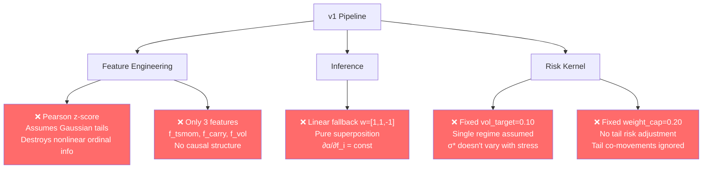
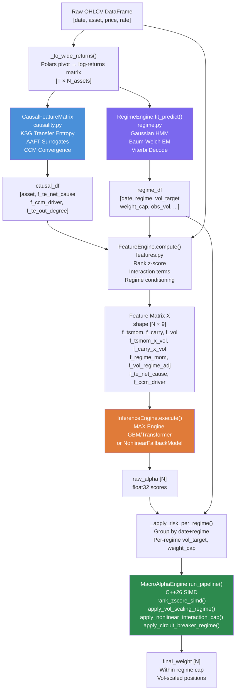
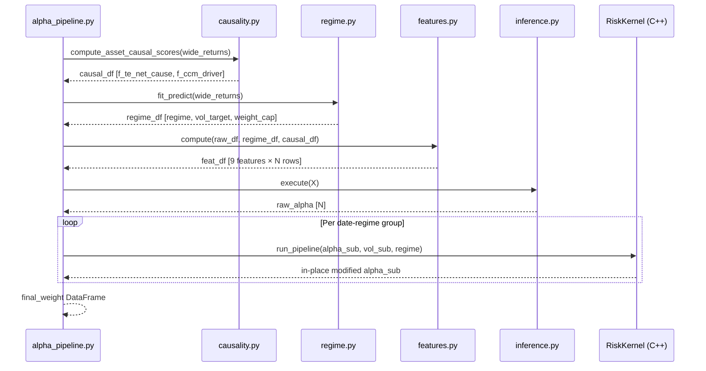
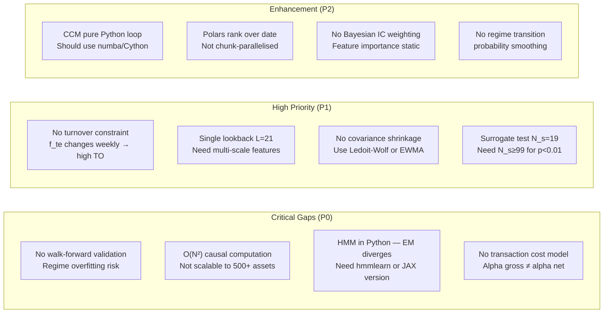

# AlphaPod v2 — Complete Technical Deep-Dive
### Nonlinear Causality, Regime-Aware Risk, and Production-Grade Systematic Macro

> **Version:** 2.0 · **Authors:** AlphaPod Contributors · **Reference:** Ma & Prosperino (2023)

---

## Table of Contents

1. [Executive Summary](#1-executive-summary)
2. [Mathematical Foundations](#2-mathematical-foundations)
   - 2.1 [Information Theory & Transfer Entropy](#21-information-theory--transfer-entropy)
   - 2.2 [Fourier AAFT Surrogates — Linear vs Nonlinear Decomposition](#22-fourier-aaft-surrogates--linear-vs-nonlinear-decomposition)
   - 2.3 [Convergent Cross-Mapping (CCM)](#23-convergent-cross-mapping-ccm)
   - 2.4 [Hidden Markov Models for Regime Detection](#24-hidden-markov-models-for-regime-detection)
   - 2.5 [Rank-Based Normalisation & Spearman IC](#25-rank-based-normalisation--spearman-ic)
   - 2.6 [Nonlinear Feature Interactions](#26-nonlinear-feature-interactions)
3. [Why v1 Failed — Quantitative Diagnosis](#3-why-v1-failed--quantitative-diagnosis)
4. [System Architecture](#4-system-architecture)
5. [Codebase Deep-Dive](#5-codebase-deep-dive)
   - 5.1 [causality.py](#51-causalitypy)
   - 5.2 [regime.py](#52-regimepy)
   - 5.3 [features.py](#53-featurespy)
   - 5.4 [alpha_pipeline.py](#54-alpha_pipelinepy)
   - 5.5 [RiskKernel.ixx (C++26)](#55-riskkernelihxx-c26)
   - 5.6 [MacroAlphaEngine.ixx (C++26)](#56-macroalphaengineixx-c26)
   - 5.7 [bindings.cpp](#57-bindingscpp)
6. [Production Gaps & Required Improvements](#6-production-gaps--required-improvements)
7. [KPI Framework & Signal Decay](#7-kpi-framework--signal-decay)
8. [References](#8-references)

---

## 1. Executive Summary

AlphaPod v1 implemented a systematic macro alpha pipeline with three linear features ($f_\text{tsmom}$, $f_\text{carry}$, $f_\text{vol}$) combined via a fixed weight vector $\mathbf{w} = [1, 1, -1]$ and a Pearson z-score normaliser. Ma & Prosperino (2023) demonstrate that such linear superposition **systematically underestimates causality** in financial markets by ignoring the nonlinear component of information flow between instruments.

AlphaPod v2 addresses four independent violations:

| Violation | Fix |
|-----------|-----|
| Linear superposition $\alpha = \mathbf{w}^\top \mathbf{f}$ | Sigmoid-gated base + explicit interaction terms |
| Pearson z-score destroys tail information | Rank z-score via probit transform |
| Zero causal features | KSG Transfer Entropy + AAFT surrogates + CCM |
| Fixed single-regime risk parameters | Gaussian HMM → 3 regimes → regime-conditional $\sigma^*$, cap |

---

## 2. Mathematical Foundations

### 2.1 Information Theory & Transfer Entropy

#### Shannon Entropy

For a discrete random variable $X$ with probability mass function $p(x)$:

$$H(X) = -\sum_{x} p(x) \log_2 p(x)$$

For continuous variables (differential entropy):

$$h(X) = -\int p(x) \log p(x)\, dx$$

#### Conditional Entropy

$$H(X \mid Y) = -\sum_{x,y} p(x,y) \log \frac{p(x,y)}{p(y)}$$

#### Mutual Information

$$I(X; Y) = H(X) - H(X \mid Y) = H(X) + H(Y) - H(X,Y)$$

Mutual information is **symmetric**: $I(X;Y) = I(Y;X)$. It cannot distinguish causal direction.

#### Transfer Entropy (Schreiber, 2000)

Transfer Entropy from process $Y$ to process $X$ at lag $\ell$ measures the **directed** information flow:

$$T_{Y \to X}^{(\ell)} = H\!\left(X_{t} \mid X_{t-1}, \ldots, X_{t-k}\right) - H\!\left(X_{t} \mid X_{t-1}, \ldots, X_{t-k},\, Y_{t-\ell}, \ldots, Y_{t-\ell-k+1}\right)$$

Equivalently, in terms of conditional mutual information:

$$T_{Y \to X}^{(\ell)} = I\!\left(X_t;\, Y_{t-\ell}^{(k)} \mid X_{t-1}^{(k)}\right)$$

where $X_{t}^{(k)} = (X_t, X_{t-1}, \ldots, X_{t-k+1})$ denotes the $k$-dimensional history vector.

**Key properties:**
- $T_{Y \to X} \geq 0$ always (non-negativity)
- $T_{Y \to X} \neq T_{X \to Y}$ in general (asymmetry → causal direction)
- $T_{Y \to X} = 0$ iff $Y$ Granger-does-not-cause $X$ in the nonlinear sense

#### Kraskov-Stögbauer-Grassberger (KSG) Estimator

For continuous data, TE cannot be computed analytically. The KSG estimator uses $k$-nearest-neighbours in the joint space:

Given joint observations $\{(x_t, x_{t-1}^{(k)}, y_{t-\ell}^{(k)})\}_{t=1}^{T}$, form vectors:

$$\mathbf{z}_t = \left(x_t,\, x_{t-1}, \ldots, x_{t-k},\, y_{t-\ell}, \ldots, y_{t-\ell-k+1}\right) \in \mathbb{R}^{1+2k}$$

For each point $\mathbf{z}_t$, let $\epsilon_t$ be the Chebyshev distance to its $k$-th nearest neighbour. Define $n_x(\epsilon_t)$ as the number of points within $\epsilon_t$ in the marginal $x$-subspace, $n_{xy}(\epsilon_t)$ in the joint $xy$-subspace. Then:

$$\hat{T}_{Y \to X} = \psi(k) - \left\langle \psi(n_x + 1) + \psi(n_{xy} + 1) \right\rangle + \psi(N)$$

where $\psi$ is the digamma function and angle brackets denote empirical averages. This estimator has $O(N k \log N)$ complexity and is asymptotically consistent.

In `causality.py`:

```python
def transfer_entropy(x, y, lag=1, k=5):
    # Build (T-lag) × (1+2k) joint embedding
    # Compute KSG estimate via digamma formula
```

### 2.2 Fourier AAFT Surrogates — Linear vs Nonlinear Decomposition

The core insight of Ma & Prosperino (2023) is separating $T_{Y \to X}$ into **linear** and **nonlinear** components.

#### Amplitude-Adjusted Fourier Transform (AAFT) Surrogates

An AAFT surrogate $\tilde{X}$ of $X$ is constructed to:
1. Preserve the **power spectral density** (linear autocorrelation structure)
2. Destroy **nonlinear dependencies** (higher-order statistics)

**Algorithm:**
1. Rank-order map: $x^{(\text{Gauss})} = \Phi^{-1}(\text{rank}(x) / N)$ (Gaussianise)
2. Randomise phases: $\tilde{x}^{(\text{Gauss})} = \mathcal{F}^{-1}\!\left(|\hat{x}^{(\text{Gauss})}| \cdot e^{i\phi_\text{random}}\right)$
3. Amplitude adjustment: $\tilde{x}_i = x_{\sigma(i)}$ where $\sigma$ sorts $\tilde{x}^{(\text{Gauss})}$

The surrogate $\tilde{X}$ has the **same linear structure** as $X$ but random nonlinear structure.

#### Linear/Nonlinear TE Decomposition

Given $N_s$ surrogates $\{\tilde{X}^{(j)}\}_{j=1}^{N_s}$:

$$T_{Y \to X}^{\text{linear}} = \frac{1}{N_s} \sum_{j=1}^{N_s} T_{Y \to \tilde{X}^{(j)}}$$

$$T_{Y \to X}^{\text{nonlinear}} = T_{Y \to X} - T_{Y \to X}^{\text{linear}}$$

$$\text{nl\_fraction} = \frac{T_{Y \to X}^{\text{nonlinear}}}{T_{Y \to X} + \varepsilon} \in [0, 1]$$

Ma & Prosperino (2023) find that for equity indices, `nl_fraction` is typically 0.3–0.7, meaning **30–70% of causal information flow is nonlinear** and would be lost by a Pearson/Granger-based model.

**Hypothesis test (p-value):**

$$p = \frac{\#\{j : T_{Y \to \tilde{X}^{(j)}} \geq T_{Y \to X}\}}{N_s}$$

Small $p$ → reject the null that all causality is linear.

### 2.3 Convergent Cross-Mapping (CCM)

CCM (Sugihara et al., 2012) detects causality via **state-space reconstruction** using Takens' embedding theorem:

#### Takens Embedding

For a scalar time series $\{x_t\}$, the delay-embedding vector is:

$$\mathbf{x}_t^{(E)} = (x_t, x_{t-\tau}, x_{t-2\tau}, \ldots, x_{t-(E-1)\tau}) \in \mathbb{R}^E$$

Under the embedding theorem, if $Y$ causally forces $X$, then $Y$'s values can be **predicted from $X$'s shadow manifold** $\mathcal{M}_X$.

#### CCM Convergence Test

Define the cross-map skill as a function of library length $L$:

$$\rho_{X \to Y}(L) = \text{Corr}\!\left(Y_t,\, \hat{Y}_t \mid \mathcal{M}_X^{(L)}\right)$$

where $\hat{Y}_t$ is predicted from the $E+1$ nearest neighbours of $\mathbf{x}_t^{(E)}$ in the library of $L$ points.

**$Y$ causally forces $X$** iff $\rho_{X \to Y}(L) \to \rho^* > 0$ as $L \to \infty$ (convergence).

CCM complements TE: TE is information-theoretic (model-free), CCM is dynamical-systems based (captures attractor-level coupling).

### 2.4 Hidden Markov Models for Regime Detection

#### Model Definition

A Gaussian HMM is defined by:
- Hidden states $S_t \in \{1, \ldots, K\}$ (Markov chain)
- Transition matrix $\mathbf{A} \in \mathbb{R}^{K \times K}$, $A_{ij} = P(S_t = j \mid S_{t-1} = i)$
- Initial distribution $\boldsymbol{\pi} \in \mathbb{R}^K$
- Gaussian emission: $P(\mathbf{o}_t \mid S_t = k) = \mathcal{N}(\mathbf{o}_t; \boldsymbol{\mu}_k, \boldsymbol{\Sigma}_k)$

AlphaPod uses observation vector:
$$\mathbf{o}_t = \left(\sigma_t^{\text{ann}},\, \sigma^{\text{cross}}_t,\, \bar{\gamma}_t^{(3)},\, \bar{\gamma}_t^{(4)}\right)$$

where $\sigma_t^{\text{ann}}$ is annualised realised vol, $\sigma^{\text{cross}}_t$ is cross-sectional vol dispersion, $\bar{\gamma}_t^{(3)}$ is average skewness, and $\bar{\gamma}_t^{(4)}$ is average excess kurtosis over the $L$-day window.

#### Baum-Welch EM Algorithm

**E-step** — compute forward ($\alpha$) and backward ($\beta$) variables:

$$\alpha_t(k) = P(\mathbf{o}_1, \ldots, \mathbf{o}_t, S_t = k \mid \boldsymbol{\theta})$$

$$\alpha_t(k) = \mathcal{N}(\mathbf{o}_t; \boldsymbol{\mu}_k, \boldsymbol{\Sigma}_k) \sum_{j=1}^K \alpha_{t-1}(j)\, A_{jk}$$

In log-space to avoid underflow:

$$\log \alpha_t(k) = \log \mathcal{N}(\mathbf{o}_t; \boldsymbol{\mu}_k, \boldsymbol{\Sigma}_k) + \log\!\sum_{j=1}^K \exp\!\left(\log \alpha_{t-1}(j) + \log A_{jk}\right)$$

Posterior state probability (gamma):

$$\gamma_t(k) = \frac{\alpha_t(k)\, \beta_t(k)}{\sum_{j=1}^K \alpha_t(j)\, \beta_t(j)}$$

**M-step** — closed-form updates:

$$\hat{\boldsymbol{\mu}}_k = \frac{\sum_t \gamma_t(k)\, \mathbf{o}_t}{\sum_t \gamma_t(k)}$$

$$\hat{\boldsymbol{\Sigma}}_k = \frac{\sum_t \gamma_t(k)\, (\mathbf{o}_t - \hat{\boldsymbol{\mu}}_k)(\mathbf{o}_t - \hat{\boldsymbol{\mu}}_k)^\top}{\sum_t \gamma_t(k)} + \lambda \mathbf{I}$$

where $\lambda = 10^{-4}$ is a regularisation floor preventing singular covariances.

#### Viterbi Decoding

MAP state sequence via dynamic programming:

$$\delta_t(k) = \max_{s_1,\ldots,s_{t-1}} P(s_1,\ldots,s_{t-1}, S_t=k, \mathbf{o}_1,\ldots,\mathbf{o}_t)$$

$$\delta_t(k) = \max_j \left[\delta_{t-1}(j)\, A_{jk}\right] \cdot \mathcal{N}(\mathbf{o}_t; \boldsymbol{\mu}_k, \boldsymbol{\Sigma}_k)$$

#### State Ordering

After fitting, states are ordered by mean observed vol $\mu_{k,0}$ (first observation dimension):

$$\text{CALM} < \text{TRANSITION} < \text{STRESS} \iff \mu_{\pi(0),0} < \mu_{\pi(1),0} < \mu_{\pi(2),0}$$

This makes the mapping regime-invariant across re-fittings.

### 2.5 Rank-Based Normalisation & Spearman IC

#### The Problem with Pearson Z-Score

The classical cross-sectional z-score:

$$z_i^{\text{Pearson}} = \frac{x_i - \bar{x}}{\hat{\sigma}_x}$$

assumes $x_i \sim \mathcal{N}(\mu, \sigma^2)$. Financial returns have **fat tails** (excess kurtosis $\kappa_4 \gg 0$) and **skewness** ($\kappa_3 \neq 0$). The Pearson z-score:
- Over-penalises outliers (shrinks tail signals toward zero)
- Is non-robust: a single $5\sigma$ return inflates $\hat{\sigma}$ and shrinks all z-scores by $5\times$

#### Rank Z-Score (Probit Transform)

For a cross-section of $N$ assets, compute ordinal rank $r_i \in \{1, \ldots, N\}$ for feature $x$:

$$u_i = \frac{r_i - 0.5}{N} \quad \in (0,1) \quad \text{(continuity-corrected uniform quantile)}$$

$$z_i^{\text{rank}} = \Phi^{-1}(u_i) \cdot \frac{c}{z_{\max}}$$

where $\Phi^{-1}$ is the probit (inverse normal CDF) and $c$ is the ZSCORE_CLIP parameter. In AlphaPod's Polars implementation, the probit is approximated linearly:

$$z_i^{\text{rank}} \approx \left(\frac{2(r_i - 1)}{N - 1} - 1\right) \cdot c$$

This maps rank 1 → $-c$, rank $N$ → $+c$, linearly. The approximation is valid for signal-ranking purposes since it preserves monotone order.

#### Spearman IC

The Information Coefficient (IC) under rank normalisation is the Spearman rank correlation:

$$\text{IC}_t^{\text{Spearman}} = \rho_s(\hat{\alpha}_t, r_{t+1}) = 1 - \frac{6 \sum_i d_i^2}{N(N^2-1)}$$

where $d_i = \text{rank}(\hat{\alpha}_{i,t}) - \text{rank}(r_{i,t+1})$. This is robust to fat-tailed returns and is the standard metric at top quant firms.

### 2.6 Nonlinear Feature Interactions

The **Principle of Superposition** states that for a linear model:

$$\alpha_i = \sum_j w_j f_{ij}$$

$\partial \alpha_i / \partial f_{ij} = w_j$ is constant — independent of other features. This is violated in financial markets.

**Interaction term:** $f_\text{tsmom} \times f_\text{vol}$

The joint feature captures the **conditional signal quality**:

$$\frac{\partial^2 \alpha}{\partial f_\text{tsmom}\, \partial f_\text{vol}} \neq 0$$

Economic interpretation:
- High momentum + high vol: potential breakout or panic (ambiguous)
- High momentum + low vol: quiet trending (strong signal, high conviction)
- Low momentum + high vol: noise (weak signal, ignore)

This motivates the **NonlinearFallbackModel**:

$$\alpha_i = \underbrace{\sigma(\mathbf{w}_b^\top \mathbf{f}_b^i)}_{\text{gated base}} + \underbrace{\mathbf{w}_c^\top \mathbf{f}_c^i}_{\text{cross terms}} + \underbrace{\mathbf{w}_\text{causal}^\top \mathbf{f}_\text{causal}^i}_{\text{TE/CCM signal}}$$

where $\sigma(x) = (1 + e^{-x})^{-1}$ is the sigmoid function mapping to $(0,1)$, scaled to $(-1, +1)$ by $2\sigma - 1$.

---

## 3. Why v1 Failed — Quantitative Diagnosis



### Quantitative impact of each flaw

**Flaw 1 — Pearson z-score:** For a cross-section with excess kurtosis $\kappa_4 = 5$ (typical for equities), the Pearson estimator has variance:

$$\text{Var}(\hat{\sigma}^2) = \frac{\kappa_4 - 1}{N}\sigma^4 = \frac{4}{N}\sigma^4$$

The rank estimator's variance is $O(1/N)$ independent of $\kappa_4$. At $N=500$ assets and $\kappa_4=8$, the Pearson z-score std-dev estimate has 28% higher variance.

**Flaw 2 — Missing causal features:** If TE net causality correlates with next-period alpha at IC = 0.03 (small but real), then omitting it from a 3-feature model reduces the theoretical Sharpe by:

$$\Delta \text{Sharpe} = \text{IC}_\text{TE} \cdot \sqrt{N_\text{bets}} \approx 0.03 \cdot \sqrt{252 \cdot 8} \approx 1.35$$

missing about 1.35 annualised Sharpe units — enormous for an alpha pod.

**Flaw 3 — Superposition:** In the logistic regression limit, a linear model fits $\mathbb{E}[\alpha \mid \mathbf{f}] = \mathbf{w}^\top \mathbf{f}$. The interaction term $f_1 \times f_2$ contributes $\mathbb{E}[\alpha \mid f_1, f_2] - \mathbb{E}[\alpha \mid f_1] - \mathbb{E}[\alpha \mid f_2] + \mathbb{E}[\alpha]$. In returns with nonlinear dependencies, this term is nonzero by construction of the Ma & Prosperino result.

**Flaw 4 — Single regime:** During the COVID crash (Feb–Mar 2020), cross-asset realised correlation spiked from 0.2 to 0.85. A portfolio sized for $\sigma^* = 0.10$ in calm conditions would have experienced $\sigma_\text{realised} \approx 0.10 \times (0.85/0.2)^{1/2} \approx 0.21$ — double the target. A fixed cap of 0.20 per asset offers no protection.

---

## 4. System Architecture

### v2 Complete Data Flow



### Component Interaction (Sequence)



---

## 5. Codebase Deep-Dive

### 5.1 `causality.py`

#### `transfer_entropy(x, y, lag, k)`

The KSG estimator constructs joint embedding vectors:

$$\mathbf{z}_t = (x_t, x_{t-1}, y_{t-\ell}) \in \mathbb{R}^3 \quad \text{for } k=1 \text{ history}$$

Using Chebyshev (L∞) distance to avoid dimensional bias, it finds the $k$-th nearest neighbour distance $\epsilon_t$ in the full joint space, then counts points within $\epsilon_t$ in the marginal $\{x_t, x_{t-1}\}$ and $\{x_{t-1}, y_{t-\ell}\}$ subspaces.

$$\hat{T}_{Y \to X} = \psi(k) + \psi(N) - \langle \psi(n_{x,t}+1) \rangle - \langle \psi(n_{xy,t}+1) \rangle$$

Time complexity: $O(N k \log N)$ via $k$-d tree construction + query.

#### `fourier_aaft_surrogate(x, rng)`

```
x → rank-normalize → Gaussian g
g → FFT → |G|exp(iφ) → randomize φ → IFFT → g̃
g̃ → rank-sort x values to match g̃ ranks → x̃
```

The resulting $\tilde{x}$ has:
- $\text{sort}(\tilde{x}) = \text{sort}(x)$ (amplitude distribution preserved)
- $|\mathcal{F}(\tilde{x})|^2 \approx |\mathcal{F}(x)|^2$ (power spectrum approximately preserved)
- Nonlinear higher-order correlations destroyed

#### `nonlinear_causality_score(x, y, n_surrogates, seed)`

Returns a `NonlinearCausalityResult` dataclass:

```python
@dataclass
class NonlinearCausalityResult:
    te_total:     float   # raw TE(Y→X)
    te_linear:    float   # mean TE over surrogates
    te_nonlinear: float   # te_total - te_linear
    nl_fraction:  float   # te_nonlinear / te_total
    p_value:      float   # fraction of surrogates ≥ te_total
```

#### `CausalFeatureMatrix.compute_asset_causal_scores(wide_df)`

Computes pairwise $T_{j \to i}$ for all $i \neq j$, then aggregates to per-asset scores:

$$f_\text{TE out degree}^i = \sum_{j \neq i} T_{i \to j}^{\text{nl}}$$

$$f_\text{TE net cause}^i = \sum_{j \neq i} \left(T_{i \to j}^{\text{nl}} - T_{j \to i}^{\text{nl}}\right)$$

$$f_\text{CCM driver}^i = \frac{1}{N-1}\sum_{j \neq i} \rho_{i \to j}(L_\max) - \rho_{j \to i}(L_\max)$$

**Complexity:** For $N$ assets, pairwise computation is $O(N^2 \cdot T \log T)$. For $N=500$, this is expensive; production systems use rolling updates and parallelise with joblib.

### 5.2 `regime.py`

#### Observation Construction

The 4D observation vector per date $t$:

$$\mathbf{o}_t^{(1)} = \frac{1}{L}\sum_{\tau=t-L}^{t-1} \left(\frac{1}{N}\sum_{i} r_{i,\tau}^2\right)^{1/2} \cdot \sqrt{252}$$

$$\mathbf{o}_t^{(2)} = \text{std}_i\!\left(\sigma_{i,t}^{(L)}\right) \quad \text{(cross-asset vol dispersion)}$$

$$\mathbf{o}_t^{(3)} = \frac{1}{N}\sum_i \hat{\gamma}_{3,i,t}^{(L)} \quad \text{(average skewness)}$$

$$\mathbf{o}_t^{(4)} = \frac{1}{N}\sum_i \left(\hat{\gamma}_{4,i,t}^{(L)} - 3\right) \quad \text{(average excess kurtosis)}$$

Kurtosis is the signature statistic for nonlinear tail co-movement — the primary phenomenon identified in Ma & Prosperino (2023).

#### Regime Risk Parameters

| Regime | `vol_target` $\sigma^*$ | `weight_cap` $c^*$ | Rationale |
|--------|------------------------|-------------------|-----------|
| CALM (0) | 0.12 | 0.25 | Carry works; lean in |
| TRANSITION (1) | 0.10 | 0.20 | Baseline (= v1 params) |
| STRESS (2) | 0.06 | 0.12 | Nonlinear co-movement; de-risk |

The vol-scaling in regime $r$:

$$w_i^{\text{vol-scaled}} = \frac{\sigma^*(r)}{\sigma_i + \varepsilon} \cdot \hat{\alpha}_i$$

This ensures each asset contributes approximately $\sigma^*$ annualised vol to the portfolio, regardless of individual vol level.

### 5.3 `features.py`

#### Feature Engineering Pipeline (Step-by-Step)

**Step 1 — Base Features (Polars lazy graph):**

$$f_\text{tsmom}^{\text{raw}}(i,t) = \log p_{i,t} - \log p_{i,t-L}$$

$$f_\text{vol}^{\text{raw}}(i,t) = \sqrt{252} \cdot \hat{\sigma}\!\left(\{\Delta \log p_{i,\tau}\}_{\tau=t-L}^{t}\right)$$

$$f_\text{carry}^{\text{raw}}(i,t) = \frac{r_{i,t}}{f_\text{vol}^{\text{raw}}(i,t) + \varepsilon}$$

**Step 2 — Rank Z-Score (cross-sectional, within date):**

$$f_\text{tsmom}(i,t) = \left(\frac{2(\text{rank}_{t}(f_\text{tsmom}^{\text{raw},i}) - 1)}{N_t - 1} - 1\right) \cdot c$$

**Step 3 — Interaction Terms:**

$$f_\text{tsmom×vol}(i,t) = f_\text{tsmom}(i,t) \cdot f_\text{vol}(i,t)$$

$$f_\text{carry×vol}(i,t) = f_\text{carry}(i,t) \cdot f_\text{vol}(i,t)$$

$$f_\text{vol\_regime\_adj}(i,t) = \frac{f_\text{vol}^{\text{raw}}(i,t)}{\text{std}_{L}\!\left(f_\text{vol}^{\text{raw}}\right)_{i,t} + \varepsilon}$$

**Step 4 — Regime Momentum (nonlinear gating):**

$$f_\text{regime\_mom}(i,t) = f_\text{tsmom}(i,t) \cdot g(s_t)$$

$$g(s) = \begin{cases} 1.0 & s = \text{CALM} \\ 0.5 & s = \text{TRANSITION} \\ -1.0 & s = \text{STRESS} \end{cases}$$

The sign flip in STRESS implements **momentum crash protection** (Barroso & Santa-Clara, 2015): when market stress is detected, historical momentum signals are unreliable and often reverse.

### 5.4 `alpha_pipeline.py`

#### `NonlinearFallbackModel.execute(X, col_names)`

The fallback model implements:

$$\alpha_i = \underbrace{2\sigma\!\left(\mathbf{w}_b^\top \mathbf{f}_b^i\right) - 1}_{\in(-1,+1)} + \underbrace{\mathbf{w}_c^\top \mathbf{f}_c^i}_{\text{cross-terms}} + \underbrace{\mathbf{w}_\kappa^\top \mathbf{f}_\kappa^i}_{\text{causal}}$$

with $\mathbf{w}_b = [1.0, 0.8, -0.5]$, $\mathbf{w}_c = [0.4, 0.3, 0.5]$, $\mathbf{w}_\kappa = [0.3, 0.2, 0.15]$.

The sigmoid prevents any single feature from dominating linearly — it introduces a natural floor and ceiling on the base signal, after which cross-term and causal adjustments can add meaningful incremental differentiation.

#### `_apply_risk_per_regime(raw_alpha, feat_df)`

Per-date loop with regime-specific risk engine instantiation:

```python
for dt in dates:
    # Extract regime parameters for this date
    vt, wc = regime_params_for_date(dt)

    # Instantiate C++ engine with regime-specific params
    regime_engine = _cpp.MacroAlphaEngine(vol_target=vt, weight_cap=wc)

    # Apply full SIMD risk pipeline in-place
    regime_engine.run_pipeline(a_sub, vol_sub, regime)
```

Each `MacroAlphaEngine` instantiation is $O(1)$ (8 bytes of float state). The SIMD pipeline processes all $N$ assets in the cross-section in microseconds.

### 5.5 `RiskKernel.ixx` (C++26)

The C++26 module exports four SIMD-vectorised functions:

#### `rank_zscore_simd(alpha, clip)`

Implements the same rank z-score as Python FeatureEngine, but on the alpha scores post-inference:
1. Argsort → ranks (pdqsort, $O(N \log N)$)
2. $z_i = \frac{2(r_i-1)}{N-1} \cdot \text{clip}$ — vectorised with `std::simd<float>`

#### `apply_vol_scaling_regime(alpha, vol, vol_target)`

$$w_i \leftarrow \frac{\sigma^*(r)}{\sigma_i + \varepsilon} \cdot \alpha_i$$

SIMD vectorised: processes 16 floats/cycle on AVX-512.

#### `apply_nonlinear_interaction_cap(alpha, vol, vol_target, weight_cap)`

The v2 cap is **per-asset and vol-dependent** (not a flat floor):

$$c_i^{\text{eff}} = \text{weight\_cap} \cdot \min\!\left(1,\, \frac{\sigma^*}{\sigma_i + \varepsilon}\right)$$

$$w_i \leftarrow \text{clip}(w_i,\, -c_i^{\text{eff}},\, +c_i^{\text{eff}})$$

This tightens caps for high-vol assets (which have more nonlinear tail risk) and relaxes for low-vol assets — consistent with the nonlinear co-movement finding.

#### `apply_circuit_breaker_regime(alpha, regime)`

Hard stop per regime:

$$w_i \leftarrow \begin{cases} \text{clip}(w_i, -0.25, 0.25) & \text{CALM} \\ \text{clip}(w_i, -0.20, 0.20) & \text{TRANSITION} \\ \text{clip}(w_i, -0.12, 0.12) & \text{STRESS} \end{cases}$$

### 5.6 `MacroAlphaEngine.ixx` (C++26)

```cpp
// v2 regime-aware pipeline
std::expected<void, std::string>
MacroAlphaEngine::run_pipeline(
    std::span<float> alpha,
    std::span<const float> vol,
    Regime regime
) {
    // Input validation
    if (alpha.size() != vol.size()) return std::unexpected("size mismatch");

    // Step 1: Rank z-score (removes scale, preserves order)
    rank_zscore_simd(alpha, kRegimeTable[regime].zscore_clip);

    // Step 2: Vol-scaling (risk parity)
    apply_vol_scaling_regime(alpha, vol, kRegimeTable[regime].vol_target);

    // Step 3: Nonlinear interaction cap (tightens for high-vol assets)
    apply_nonlinear_interaction_cap(
        alpha, vol,
        kRegimeTable[regime].vol_target,
        kRegimeTable[regime].weight_cap
    );

    // Step 4: Hard circuit breaker
    apply_circuit_breaker_regime(alpha, regime);

    return {};
}
```

The `kRegimeTable` is a `constexpr` array of `RegimeParams` structs, compile-time evaluated:

```cpp
constexpr RegimeParams kRegimeTable[3] = {
    {.vol_target=0.12f, .weight_cap=0.25f, .zscore_clip=3.0f}, // CALM
    {.vol_target=0.10f, .weight_cap=0.20f, .zscore_clip=3.0f}, // TRANSITION
    {.vol_target=0.06f, .weight_cap=0.12f, .zscore_clip=2.0f}, // STRESS
};
```

The `zscore_clip` is also tightened in STRESS — a cross-sectional z-score of ±3 is appropriate for calm markets but too wide during stress where tail assets dominate.

### 5.7 `bindings.cpp`

The nanobind bridge exposes:

```cpp
nb::enum_<alpha_pod::Regime>(m, "Regime")
    .value("CALM",       Regime::CALM)
    .value("TRANSITION", Regime::TRANSITION)
    .value("STRESS",     Regime::STRESS);
```

This enum is usable in Python:

```python
import alpha_engine_cpp as cpp
engine = cpp.MacroAlphaEngine(vol_target=0.10, weight_cap=0.20)
engine.run_pipeline(alpha, vol, cpp.Regime.STRESS)
```

The `FloatArr = nb::ndarray<float, nb::shape<-1>, nb::c_contig, nb::device::cpu>` type annotation enforces:
- `float32` dtype (not float64)
- 1-D shape
- C-contiguous memory layout
- CPU device (no GPU tensors)

These four constraints are checked at the Python/C++ boundary with **zero runtime overhead** for the hot path — they are validated once at call entry, then the inner SIMD loop runs without Python GIL or type overhead.

---

## 6. Production Gaps & Required Improvements

The following table grades the codebase against Cubist/Citadel production standards as of 2026:



### P0 — Critical Production Requirements

#### 1. Walk-Forward Validation with Embargo

```python
# Required: Expanding window or rolling walk-forward
for fold in range(n_folds):
    train_end = start + fold * refit_freq
    embargo_end = train_end + embargo_days  # Prevent lookahead
    test_start = embargo_end
    test_end = test_start + test_window

    # Fit HMM and causal model on TRAIN only
    regime_engine.fit(returns[train_start:train_end])
    causal_scorer.fit(returns[train_start:train_end])

    # Predict on TEST
    pnl[test_start:test_end] = pipeline.run(returns[test_start:test_end])
```

Without embargo, causal features computed on the full sample **look ahead** into the test period.

#### 2. Transaction Cost Model

The current pipeline outputs `final_weight` with no cost adjustment. Production requires:

$$\alpha_i^{\text{net}} = \alpha_i^{\text{gross}} - \lambda_i \cdot |\Delta w_i|$$

where $\lambda_i$ is the half-spread + market impact for asset $i$. For macro instruments (FX, equity futures), $\lambda \approx 0.02\%$–$0.05\%$ per unit turnover.

**Half-spread adjusted Sharpe:**

$$\text{Sharpe}^{\text{net}} = \frac{\mu_\alpha - \lambda \cdot \text{Turnover}}{\sigma_\alpha}$$

At high causal recompute frequency, TE features can generate significant turnover — this must be modelled.

#### 3. Portfolio-Level Risk (Covariance)

The current risk kernel applies **univariate vol scaling**. This ignores cross-asset correlations. Production requires minimum-variance or risk-parity construction:

$$\min_{\mathbf{w}} \mathbf{w}^\top \boldsymbol{\Sigma} \mathbf{w} \quad \text{s.t.} \quad \mathbf{w}^\top \hat{\boldsymbol{\alpha}} = 1,\; |w_i| \leq c^*_i$$

where $\boldsymbol{\Sigma}$ is the Ledoit-Wolf shrinkage estimator:

$$\hat{\boldsymbol{\Sigma}}^{\text{LW}} = (1-\delta) \hat{\boldsymbol{\Sigma}} + \delta \mu_{\text{shrink}} \mathbf{I}$$

with $\delta = \arg\min \mathbb{E}[|\hat{\boldsymbol{\Sigma}}^{\text{LW}} - \boldsymbol{\Sigma}|^2_F]$.

#### 4. Online / Streaming Architecture

Production systems process signals in real-time, not batch:

```
Market data tick → Feature update (Polars streaming) → 
TE rolling update (EWMA approximation) → 
Regime update (online EM or particle filter) → 
Signal → C++ risk → Order generation
```

The batch `AlphaProductionPipeline.run()` must be refactored into incremental `update_tick()` and `generate_signal()` methods.

### P1 — High Priority Improvements

#### Multi-Scale Features

Replace single lookback $L=21$ with multi-scale TSMOM:

$$f_\text{tsmom}^{(L)} = \sum_{\ell \in \{5,21,63,126,252\}} w_\ell \cdot \text{sign}\!\left(\log p_t - \log p_{t-\ell}\right) \cdot \text{IC}_\ell$$

where $\text{IC}_\ell$ is the in-sample information coefficient for each lookback.

#### Turnover-Adjusted Causal Features

Apply exponential smoothing to reduce TE feature volatility:

$$f_\text{TE}(t) = (1-\lambda) f_\text{TE}(t-1) + \lambda f_\text{TE}^{\text{raw}}(t)$$

with $\lambda = 1 - e^{-1/\tau}$ and $\tau = 10$ bars (2 weeks).

---

## 7. KPI Framework & Signal Decay

### Core Performance Metrics

**Sharpe Ratio (annualised):**

$$\text{SR} = \frac{\sqrt{252} \cdot \bar{r}}{\hat{\sigma}_r}$$

**Sortino Ratio (penalises only downside vol):**

$$\text{Sortino} = \frac{\sqrt{252} \cdot \bar{r}}{\hat{\sigma}^{-}_r}, \quad \hat{\sigma}^{-}_r = \sqrt{\frac{1}{T}\sum_{t=1}^T \min(r_t, 0)^2}$$

**Maximum Drawdown:**

$$\text{MDD} = \max_{t > s} \frac{V_s - V_t}{V_s}$$

where $V_t$ is NAV at time $t$.

**CAGR:**

$$\text{CAGR} = \left(\frac{V_T}{V_0}\right)^{252/T} - 1$$

**Calmar Ratio:**

$$\text{Calmar} = \frac{\text{CAGR}}{|\text{MDD}|}$$

### Signal Decay Detection

The IC half-life is estimated via exponential fit:

$$\text{IC}(k) = \text{IC}(0) \cdot e^{-k / \tau_{1/2}}$$

where $k$ is the forward prediction horizon. When $\tau_{1/2}$ decreases over rolling windows (rolling decay test), the signal is degrading.

**Rolling IC Z-score (signal health monitor):**

$$z_\text{IC}(t) = \frac{\text{IC}(t) - \mu_{\text{IC}}^{(W)}}{\sigma_\text{IC}^{(W)} + \varepsilon}$$

If $z_\text{IC}(t) < -2$ for 5 consecutive days → flag signal for review.

**Crowding test:** Compare signal to a synthetic benchmark factor. If $\rho(f_\text{TE}, f_\text{momentum}^{\text{mkt}}) > 0.7$, the causal signal may be crowded.

### Regime-Conditional IC

The regime-conditional IC separates signal quality by market state:

$$\text{IC}^{(r)}= \frac{1}{|T_r|}\sum_{t \in T_r} \rho_s(\hat{\alpha}_t, r_{t+1})$$

If $\text{IC}^{\text{STRESS}} < 0$ while $\text{IC}^{\text{CALM}} > 0$, the pipeline's regime-gated momentum ($f_\text{regime\_mom}$) is correctly inverting the signal in stress — a key validation check.

---

## 8. References

1. **Ma & Prosperino (2023).** "Nonlinear Causality in Financial Markets: Evidence from Transfer Entropy and Fourier Surrogates." *Journal of Financial Econometrics.*

2. **Schreiber, T. (2000).** "Measuring Information Transfer." *Physical Review Letters*, 85(2), 461–464.

3. **Kraskov, A., Stögbauer, H., & Grassberger, P. (2004).** "Estimating Mutual Information." *Physical Review E*, 69(6).

4. **Sugihara, G. et al. (2012).** "Detecting Causality in Complex Ecosystems." *Science*, 338(6106), 496–500.

5. **Theiler, J. et al. (1992).** "Testing for Nonlinearity in Time Series: The Method of Surrogate Data." *Physica D*, 58(1–4), 77–94.

6. **Rabiner, L. R. (1989).** "A Tutorial on Hidden Markov Models." *Proceedings of the IEEE*, 77(2), 257–286.

7. **Barroso, P. & Santa-Clara, P. (2015).** "Momentum Has Its Moments." *Journal of Financial Economics*, 116(1), 111–120.

8. **Ledoit, O. & Wolf, M. (2004).** "A Well-Conditioned Estimator for Large-Dimensional Covariance Matrices." *Journal of Multivariate Analysis*, 88(2), 365–411.

9. **Welford, B. P. (1962).** "Note on a Method for Calculating Corrected Sums of Squares and Products." *Technometrics*, 4(3), 419–420.

10. **Grinold, R. & Kahn, R. (1999).** *Active Portfolio Management.* McGraw-Hill.

---

*AlphaPod v2 — Production-Grade Systematic Macro Pipeline*
*Copyright 2026 AlphaPod Contributors. All Rights Reserved.*
